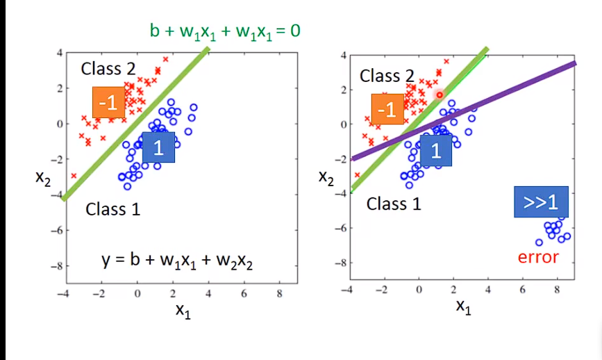
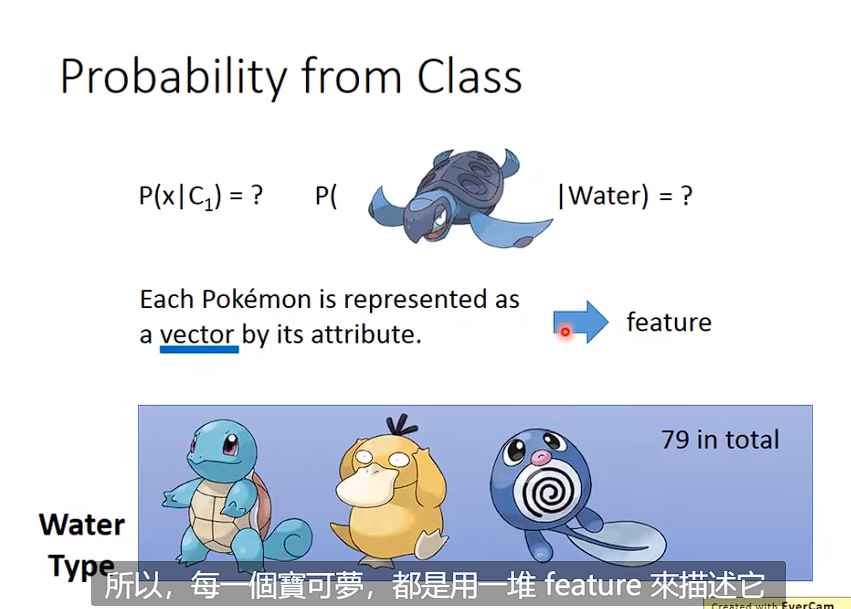
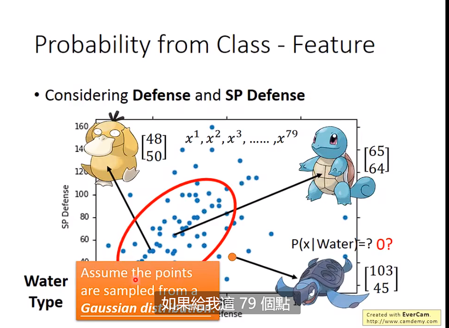
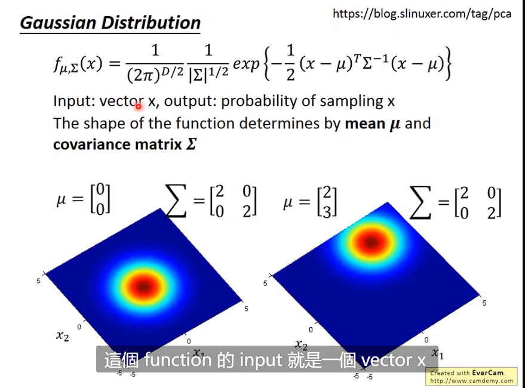
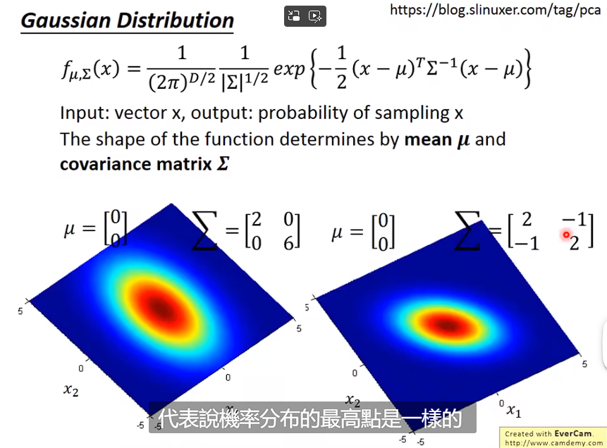
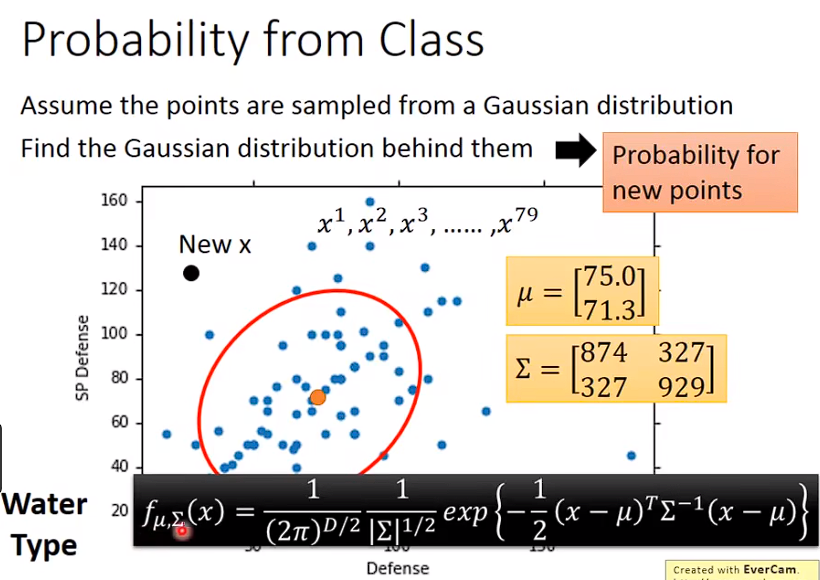
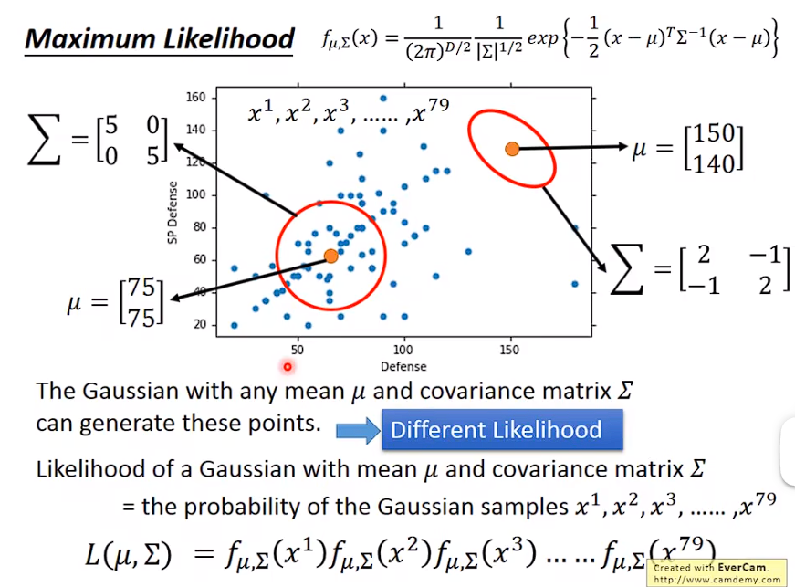
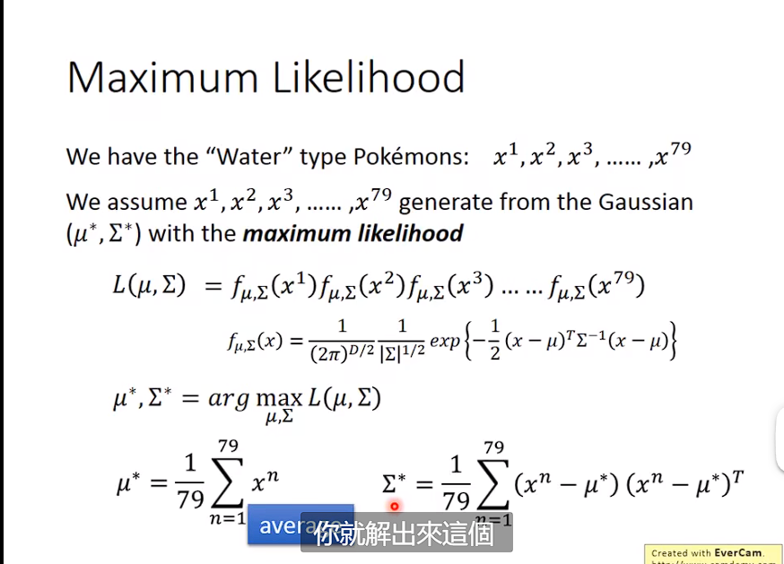
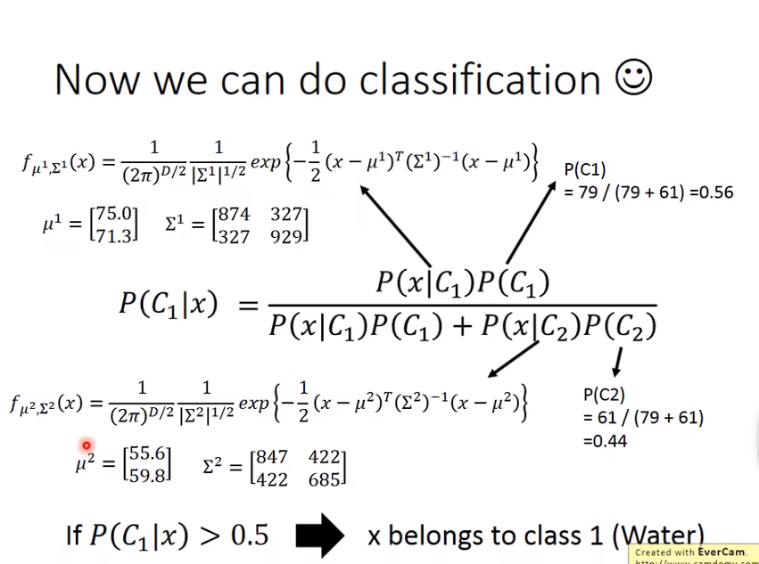

# Classification

Classification 任务不能当做Regression任务的原因
举例


## Classification不能当做Regression任务做的原因
```
如右图 

1、远远大于1的点，按照regression进行计算会远远大于1
2、我们期望的是，接近1的为Class 1 接近-1的为Class 2
3、这样导致>>1的数 其实是error的。 最终会得到紫色的分割线
4、原因是regression对于model好坏的定义是不适合用在这个地方的。
5、regression model会惩罚那些值太大的点。

for Example:
比如一个Multiple Class Task:
我们简单的把
Class 1 对应 1
Class 2 对应 2
Class 3 对应 3
其实就是默认，Class 1和Class 2比较接近，Class 2和Class 3比较接近。其实是不正确的。
```
```
同理 Regression任务是否可以当做Classification任务做呢
显然是不能的，正如上面所示，Regression的1,2,3,4,5之间是有序列关系的。
但是，如果你所需要的分类之中没有这种近似 邻近的关系，显然是不行的。
```








## 建议去看下二维高斯



```
使用似然函数L找到 一个Gaussian,他sample出这79个点的概率最大。
```
 

```
通俗易懂讲解协方差的文章
https://zhuanlan.zhihu.com/p/672965170
```


```
μ和Σ是从那71个宝可梦的分布中得到的结果。最终得到fμ,Σ 的分布
```