# Attention
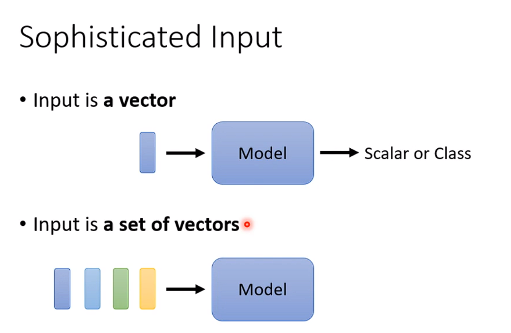
+ 输入是一排向量的情况、而且输入向量的个数还是会改变的情况
+ 比如文字处理，比如输入一个句子，每个句子的长度都不一样，我们把一个句子中的每一个词汇都描述成一个向量，那么我们的Model的输入 就是一个Vector Set,而且这个Vectoer Set的大小每次都不一样
+ 怎么把一个词汇表示成一个向量呢，最简单的方法One-hot Encodding,开一个很长很长的向量，这个向量的长度 和世界上所有词汇的长度一样。
+ One-Hot的表示方法 ，使得各个向量的表示之间 没有关系。
+ 还有一种向量的表示方法，WordEnbedding
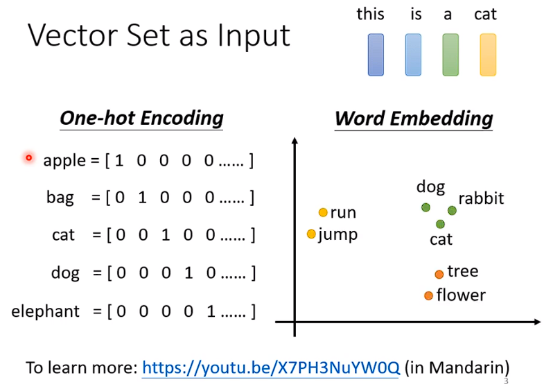
+ 会给每个词一个向量

## 还有什么情况下输入的是一个向量的Set
+ 语音，一段声音讯号  (取一个window ，类似时间序列)
+  

## Sequence Labeling
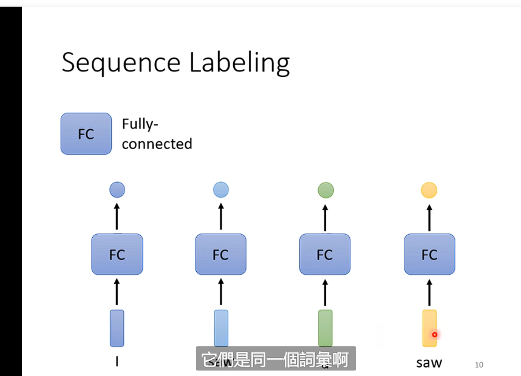
+ 如果使用FC NET则 各个向量之间是孤立的
+ I saw a saw ，(他会将第一个saw和第二个saw当成相同的东西)
+ 如果我使用整个sequence 开一个window 则，window都是最大的sequence的长度，这样的计算量是巨大的。参数量会很大 而且会overfitting
+ 

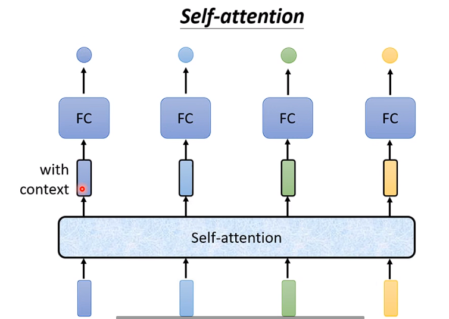
+ 这些输出的vector都是考虑了整个sequence得到的
+ 再把这个考虑了整个句子的向量 仍进FC net然后再决定出 ，他到底是个什么样的东西。什么样的类别 或者output什么样的数字
+ 还可以 交替使用self-attention
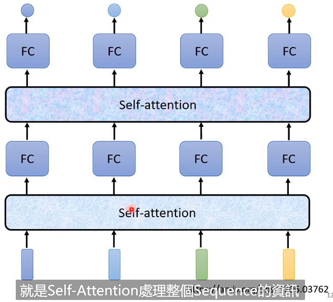

+ self-attention的input可能是input也有可能是hidden layer的输出
+ 
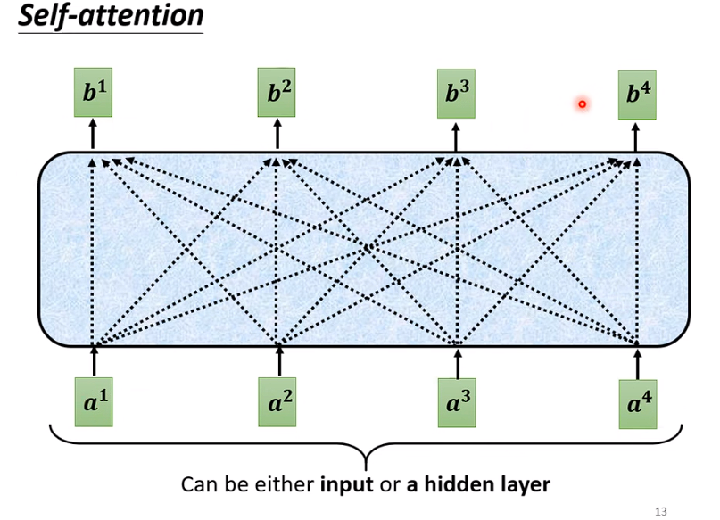

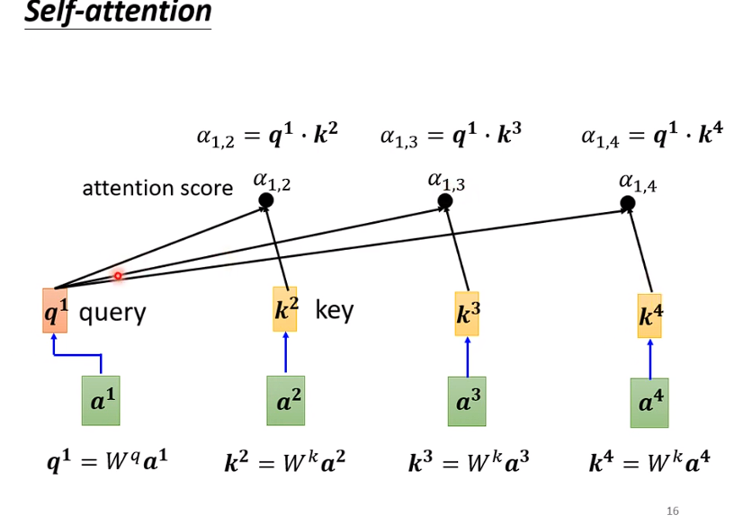
+ 在实操的时候  一般q_1也会和k_1计算注意力分数得到α_1，1
+ 注意力分数 可以过soft-max 也可以过relu
+ 
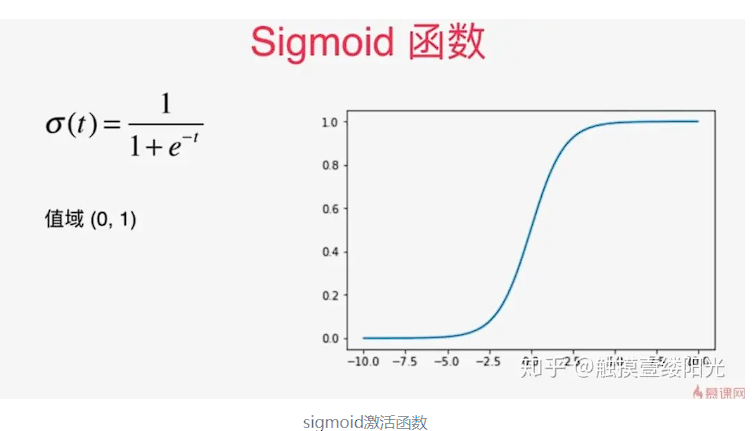
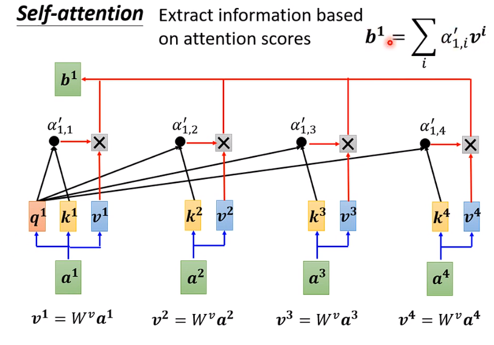
+ 再用W_v左乘a 得到V1...V4

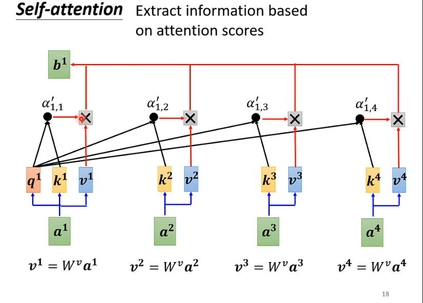
+ 得到V=Wa
+ 再用V乘以对应的attention score   
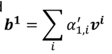
+ 相乘 之后累加 得到b_1

+ q_2 和每一个 k算注意力分数 得到α_2,...n 然后再用这个注意力分数
和每个 值的V相乘 得到b_2  这样子 如果说a1 a2关联程度比较大
+ 那么a1 a2得到的注意力分数就会比较大,然后weight sum之后，算出来的b_1值就会比较接近a_2
+ 结果就是哪个相关性比较大，attention score最大，谁就会主导你的结果比如b1

+ b1...b4都是同时被计算出来的

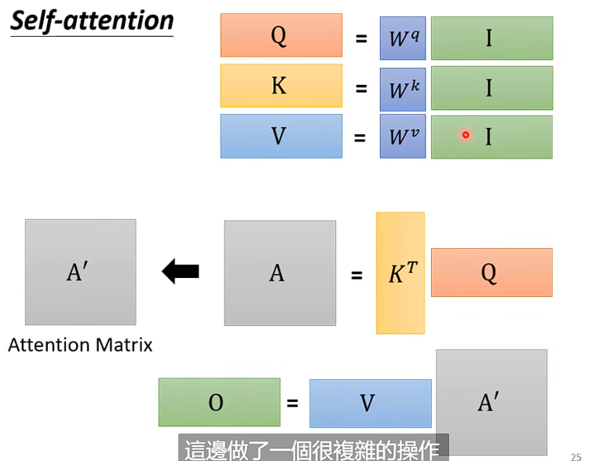

+ self-attention 要学的就只有wq wk 和wv而已
+ O 就是b1...b4

## Multi-head Self-attention
+ 相关这件事，他可以有很多不同的形式。有很多种不同的定义
+ 也许我们应该有多个q，每个q负责不同种类的相关性
+ 除了W_q 还有W_q_1 还有 W_q_2


+ 

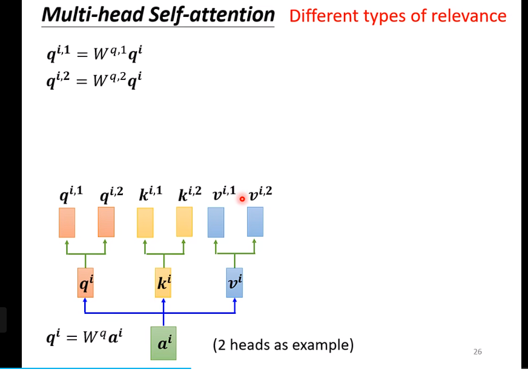

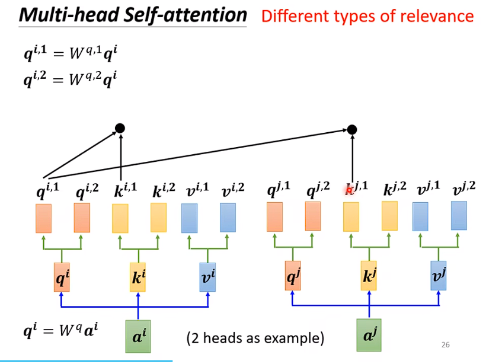
+ 只管 自己相关的"头"
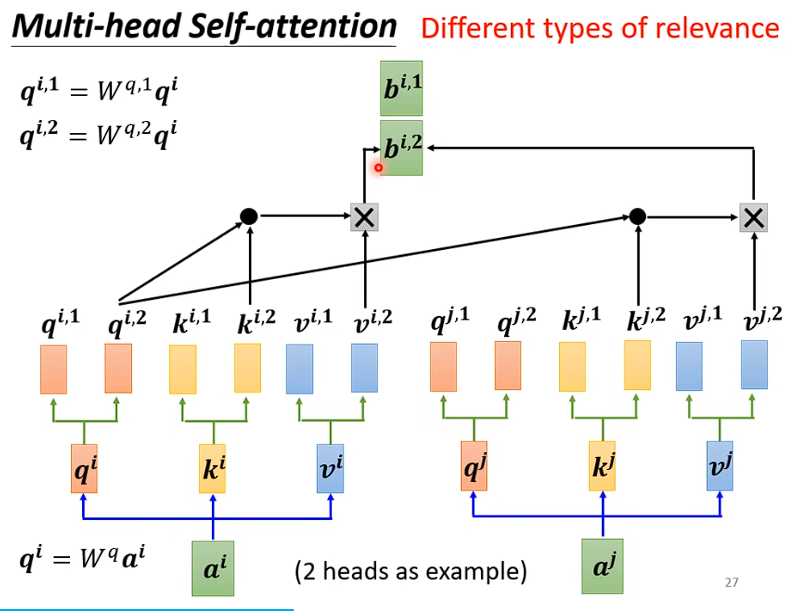

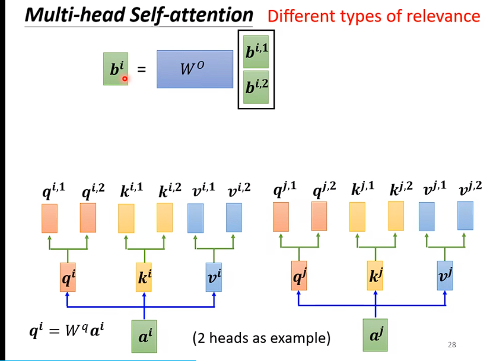
+ bi_1和bi_2 concat出来 再乘以一个权重矩阵得到bi

# Positional Encoding
+ No position information in self-attention
+ 解决方法：
+ 为每一个位置设置一个positional vector $e^i$
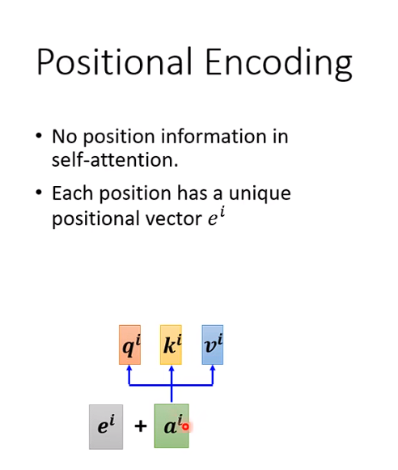
+ 加了之后就能辨识出 似乎 a_i有加上e_i他就觉得应该有这个信息
+ 因为e_i是一个高维的向量，所以说矩阵相乘的时候就有可能 辨识出来？？
+ 可是计算相乘之前是不乘以W的呀
+ sin cos 产生的。 positional encoding也是可以学出来的
+ 

## Truncated Self-attention
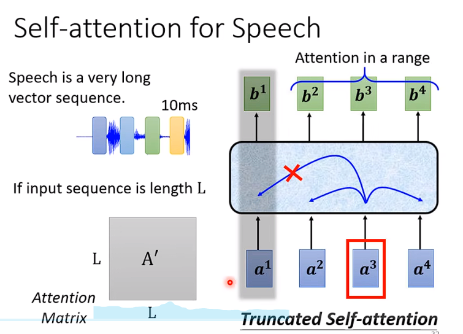
+ 不需要看整个序列， 只看一部分就好
+ 


❤️

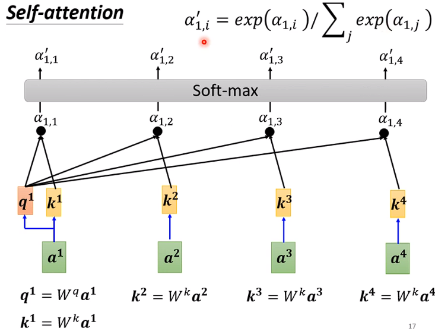
```
a1...a4都是一个个的element(元素)
W都代表矩阵 a 代表向量  
```
$$
W^q a^1代表向量a^1乘以权重矩阵W^q,W^k a^2代表向量a^2乘以权重矩阵W^k
$$
$$
W^k a^2、W^k a^3、W^k a^4代表K^2,K^3,K^4
$$
分别将$ q^1与K^2、K^3、K^4$计算注意力Score，得到注意力分数$\alpha_1$,然后再经过Softmax得到$\alpha^1 $
```
这个地方用Softmax或者relu什么 activate fuction都可以
```


# Before
## 计算注意力分数
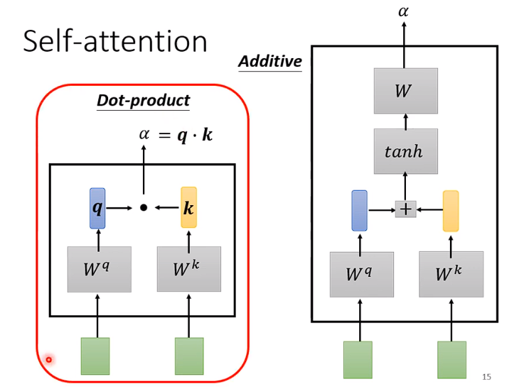

```
Dot-product 是将q与k点乘
一般来说用的都是这种
```

附件：(关于Additive)

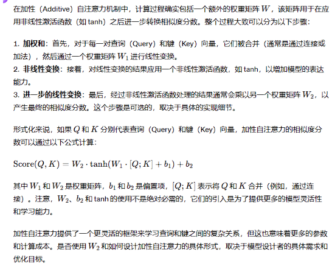

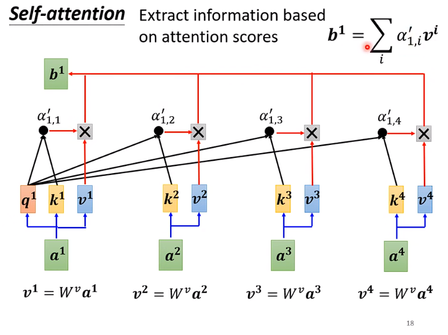

将$a^1 a^2 a^3 a^4乘以 W^v 得到V^1，V^2，V^3，V^4 和注意力分数（经过softmax之后）相乘，然后相加得到b^1$ 
```
计算loss之后反向确定权重，最后得到，越重要的V所占的权重越大。
谁的Attention分数最大，谁就会Dominant你抽出来的结果
```

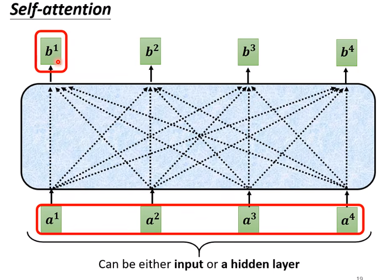

