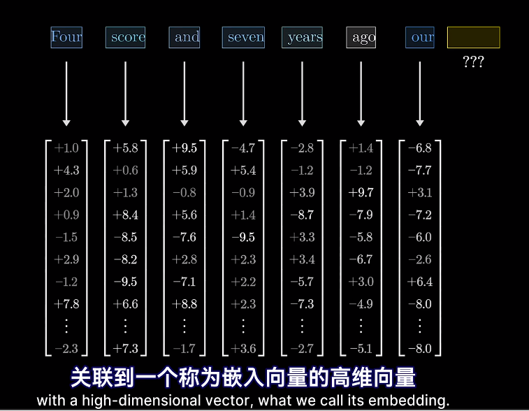
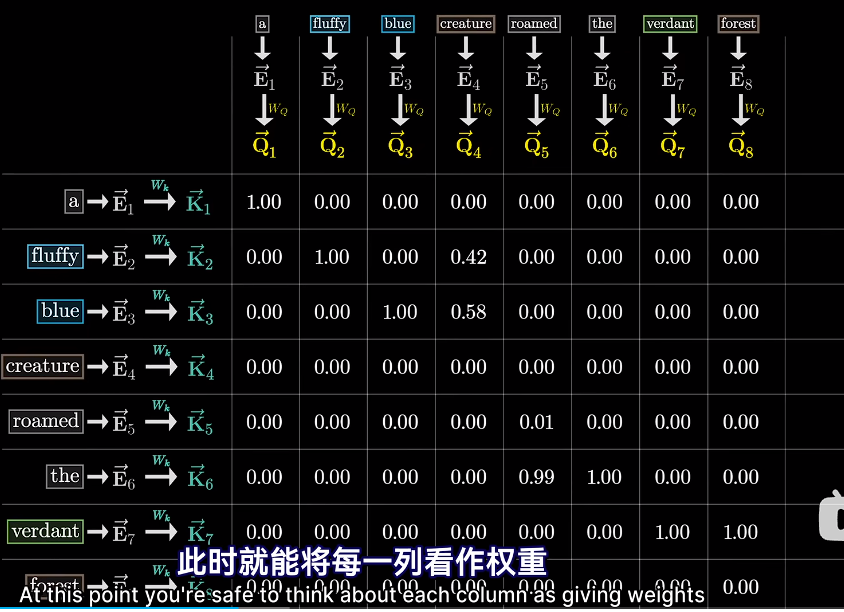

# Attention_3blue1Brown
```
https://www.bilibili.com/video/BV1TZ421j7Ke/?spm_id_from=333.788.recommend_more_video.1&vd_source=ba966217d93ed0858c8972cc7a95e1cf
```
## review

## Transformer的第一步
+ 第一步是将每个token关联到一个称为embedding的高维嵌入向量

## Embedding

+ **关于embedding**

+ 对于图中，father和mother之间的距离与man和woman之间的距离可能是相近的。
## Transfomer的作用

+ Transformer的目标是逐步调整这些嵌入
+ 使得他们不单单编码某个单词，还能融入更丰富的上下文的语义。


## 在最开始时，相同单词embedding对应的都是同一个向量

+ 因为初始token的嵌入，本质是没有上下文参照的查找

## 等到attnention这一步 周围的信息才能传递到该嵌入向量


+ 训练好的注意力模块，可以计算出给初始的嵌入加一个什么向量。才能将他移动到上下文对应的具体方向上，
## 此时预测下一个token的计算过程
+ 完全基于序列中最后一个向量


## 要预测下一个值，完全取决于  was 这个嵌入向量

+ 这个was 必须经过所有注意力模块的更新
+ 以包含远超单个词的信息量

+ 

+ 我们把Position Embedding 和 word Embedding 统一表示为嵌入E
+ 我们的目标是经过一系列的计算，产生一组新的，更为精确的嵌入向量。


+ 在深度学习中，我们希望多数计算都是矩阵向量乘法
+ E向量是一个非常复杂的向量，乘以矩阵W_q被变成了一个小得多的向量 一般为128,1

+ E向量是一个非常复杂的向量，乘以矩阵W_k被变成了一个小得多的向量 一般为128,1


## 匹配程度矩阵


+ 圆越大，点积越大，键与查询就越接近
+ 

+ 这个嵌入之间相互注意到的过程 ，是通过loss反向传播得到的
+ 注意力分数是有可能为负数的


+ 然后再将这些分数。与V进行加权求和
+ V也是E 乘以W_v矩阵得到的
+ 因为要V乘以这些进行加权求和，这样的话，q,k表格之间的注意力分数 就不可以是负无穷到正无穷之间的任何实数，而是要介于0-1之间，Q*K得到的矩阵的每一列，代表这个Q和K之间的匹配分数，既然要归一化，那么每一列数值的和等于1，就像概率分布一样。即 对每一列应用softmax 函数进行归一化


+ 计算之后再填回去
+ 此时就能将每一列看做权重，表示左侧的键与顶部的查询的相关度

+ Attention Pattern
+ 

+ 为了数值稳定性，建议将所有点积除以key-query空间维度的平方根

+ 外面套的softmax函数 应理解为逐列的计算
## 另一个技术细节

+ 如果仅仅使用整个示例文本跑模型
+ 模型会根据正确预测出下一词的概率高低，来进行奖惩，并微调各个的权重
+ 还有一种效率更高的方式，让它同时预测，每一个初始token子序列之后，所有可能的下一个token

+ 举个例子

+ 这个短语 可以同时预测 creature【生物】的下一个词
+ 也可以去预测the 的下一个词

+ 对于注意力来说，这种情况就不可能让后面的去影响前面的结果，不然就会泄漏接下来的答案，

+ 能被强制变成0，但是强制变成0这样每列的总和就不再是1了
+ it's not normalized
+ 所以常见的方法是 ，在应用softmax之前
+ 把对角线下面的部分置为负无穷大
+ 这样应用softmax之后，他们都会变成0，但列扔保持归一化

+ 这种机制叫做masking
+ 也有相当多的注意力机制，不应用掩码
+ attention pattern 他的大小等于上下文长度的平方！


+ 下面这些是attention的变体 旨在使得上下文更具有扩展性

+ Value

+ 此处的值矩阵W_v 为12288*12288
+ (12288,12288)*(12288,1)=(12288,1)
+ (12288,1)+E_4 (12288,1)=$E^{'}$ (12288,1)


### 以上就是单头注意力
+ 这个过程由三种填满了可调参数的矩阵实现
# 我们来计算一下GPT-3模型本身的总参数数量


## 设计上来讲，值矩阵的参数量，可以比键矩阵和查询矩阵多好几个数量级
+ 但实际上更高效的做法，是让值矩阵所需要的参数量等于
键矩阵和查询矩阵的参数之和
+ 对于并行运行的多头注意力来说，这一点尤为重要


+ 具体的做法是 将值矩阵分解为两个小的矩阵相乘

+ 从概念上讲，我还是建议你把他整体视为一个线性映射

+ 在线性代数中，这种操作的实质就是，对大矩阵进行[低秩分解]  LoRA??

+ GPT3的一个注意力头 就包含约630万个参数

## Self-attention和Cross-attention

# Cross-attention
## Cross-attention的模型 会处理两种不同类型的数据
+ 比如 **1、原文**和 **2、正在被翻译出来的译文**
+ 或者是 **语音音频** 与 **正在被转录出来的文字**
## Cross-attention和self-attention几乎相同
+ 唯一的区别是 key 和 query的矩阵作用于不同的数据集
+ 在文本翻译类的任务中，key来自一种语言，value来自另一种语言


+ 一种语言中的哪些词，对应另一种语言中的哪些词
+ 这种情况下，通常不会使用掩码，因为不存在，后面token影响前面token的问题
## 多头注意力

+ 这意味着有96个不同的W_q和W_k
+ 产生96种不同的注意力模式
+ 每个注意力头 都有独特的值矩阵


+ 用来产生96个值向量序列
+ 也就是说，对于上下文中的每个位置，也就是每个token,
每个头都会给出一个要加入该位置的变化量，
+ 你要做的就是，把每个头给出的变化量加起来


+ 通过这个模块，可以得到一个更精确的嵌入
+ 根据多头注意力，模型能学习到根据上下文来改变语义的多种方式。

### W_v的具体实现有所不同


+ 单个注意力头的值矩阵 单指 (将嵌入向量投影到低维空间的【值↓矩阵】)


# More
```
https://transformer-circuits.pub/2021/framework/index.html
```


# More
