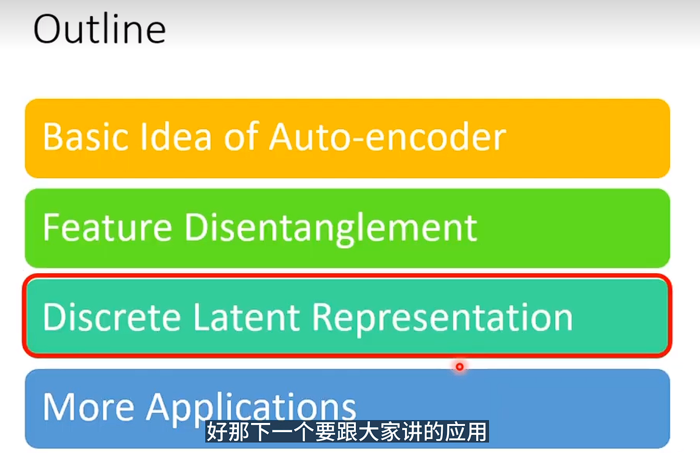
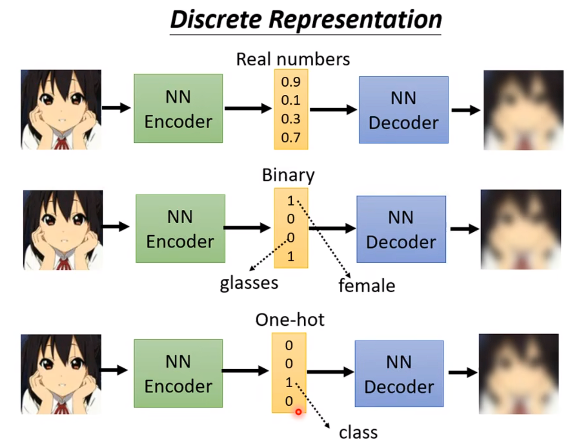

# Auto-encoder
## Self-supervised learning Framework

```
https://www.youtube.com/watch?v=JZvEzb5PV3U
```
+ 你必须去找到一些，不需要标注资料的任务给你的模型
+ 比如扣空填词
+ 比如预测下一个token
+ Self-supervised learning也可以被叫做Pre-training
+ encoder 和 decoder都是多层的network


用处1  
+ 之前的高维向量，经过encoder之后 变成一个相对低维的向量。  使用这个低维向量去做想做的事情
+ Encoder的过程可以叫做Embedding Representation,Code
+ 也可以用来做数据降维
+ 使得输出的图片和原始的图片接近的这个过程，可以叫做重建(reconstruction)As close as possible

## More Dimension Reduction
+ 更多数据降维的资料


## Why Auto-encoder?

+ 正常的图片的变化还是有限的。虽然说图片是3X3 应该用9个数字去存储，但是实际上也许他的变化的类型 其实是非常有限的。


+ 化繁为简，把本来复杂的东西 用比较简单的方法来表示他，下游任务中 可能就只需要比较简单的训练资料。

## De-noising Auto-encoder


## Feature Disentanglement
**特征解纠缠**


+ 以上的content,speaker..的信息纠缠在一起，
我们需要将他们解开 Feature Disentangle


+ 我们想要知道 以上 哪些部分代表语音的内容，哪些部分代表，说话者的身份，我们期望做Feature Disentangle.
+ 解耦表征学习

## Feature Disentangle


+ 如果我们知道哪一部分代表声音的内容，哪一部分代表语者的身份，那么我们就可以把声音内容和语者的部 分互换。
+ 




如果中间使用One-hot 就有可能使得，在完全没有标签的情况下，对0-9手写数字进行分类。
## Discrete Representation


## 传统Auto-encoder是把最后一个时刻的embedding传入进去

+ 但是 只传入最后一个时刻的embedding其实信息是不是很好的
+ 比如，我翻译Hello 这时候是不需要用到整条句子的信息
hello world的，
+ 我要根据我目前这个时刻要翻译对象去选择，而不是最后一个时刻 综合了前面所有的embedding去选择，