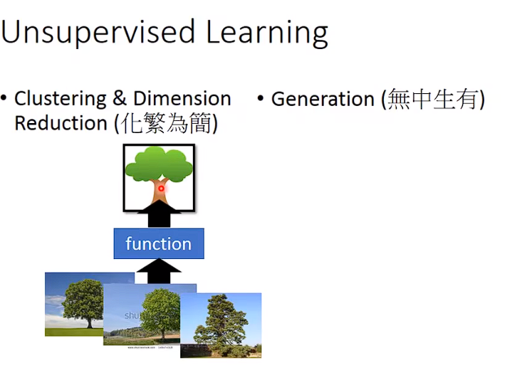
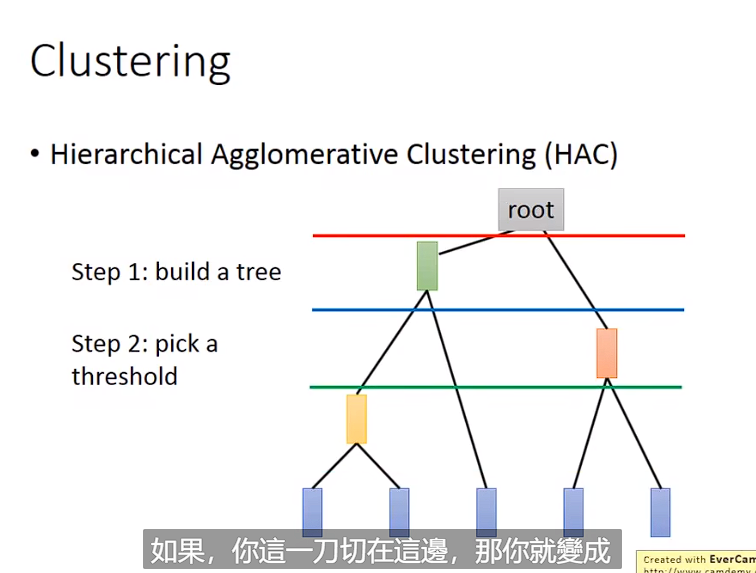
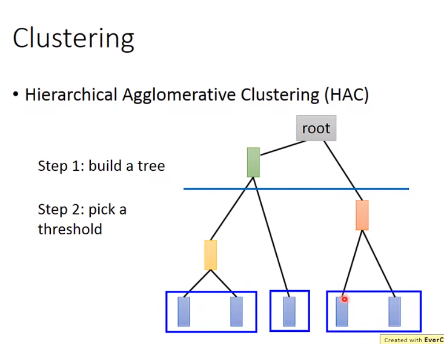
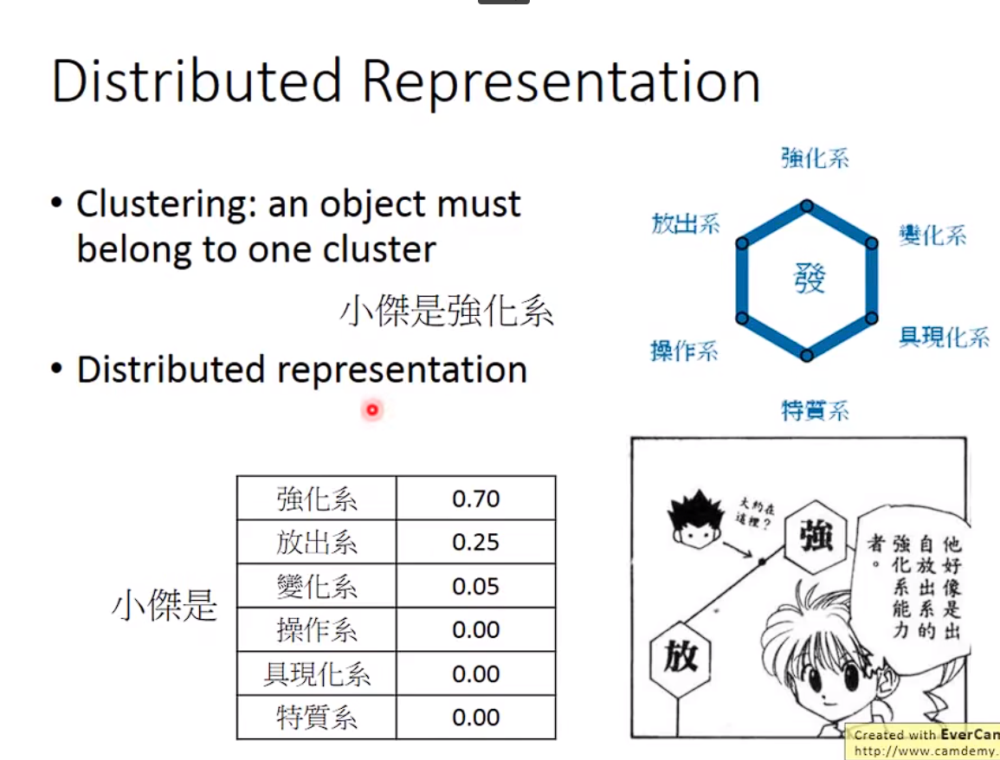
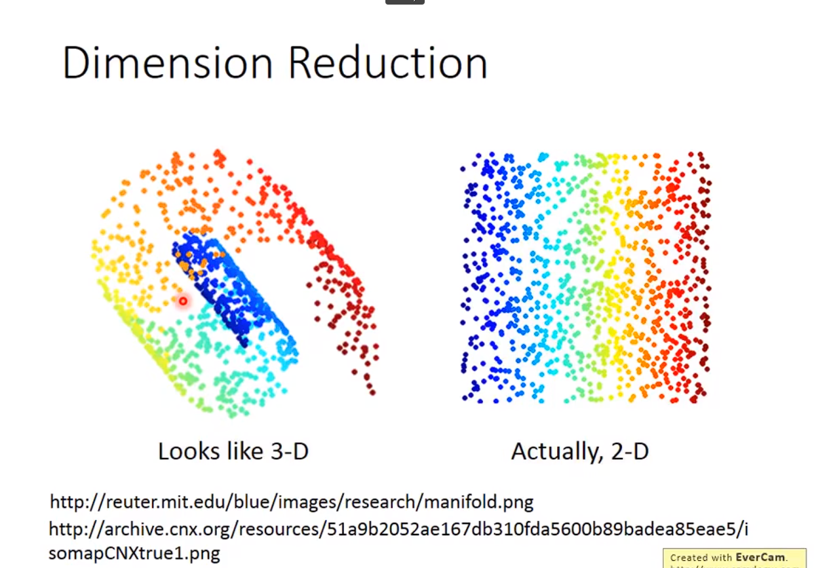
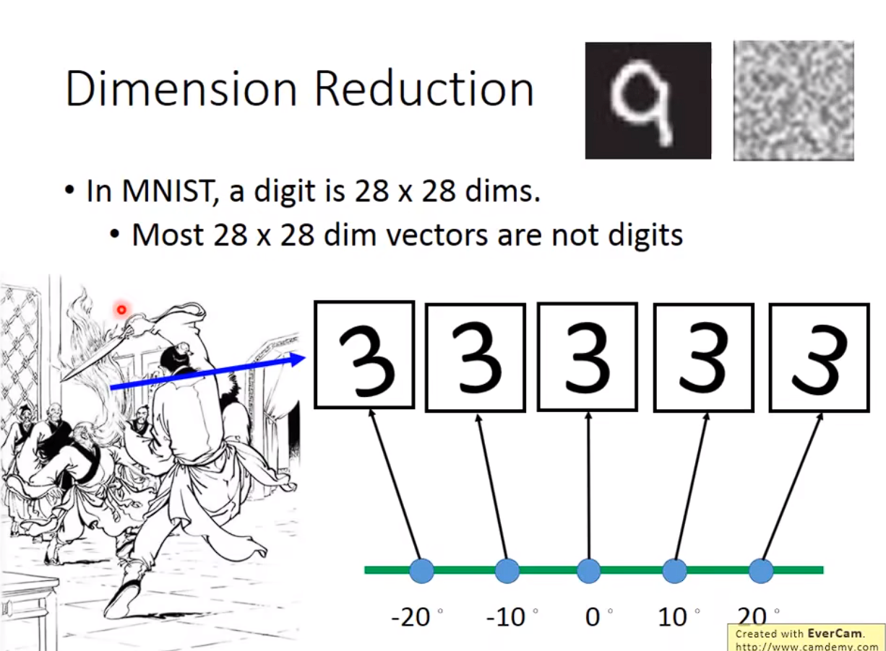
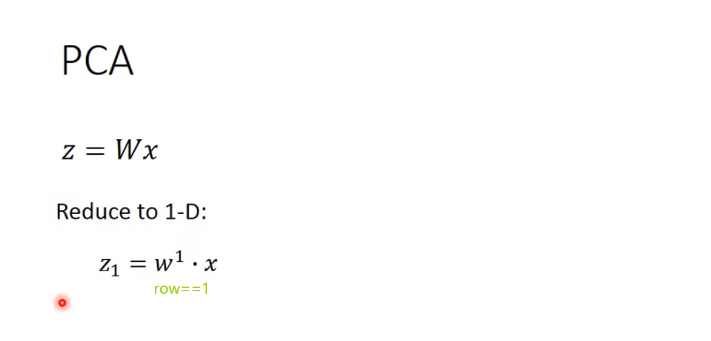
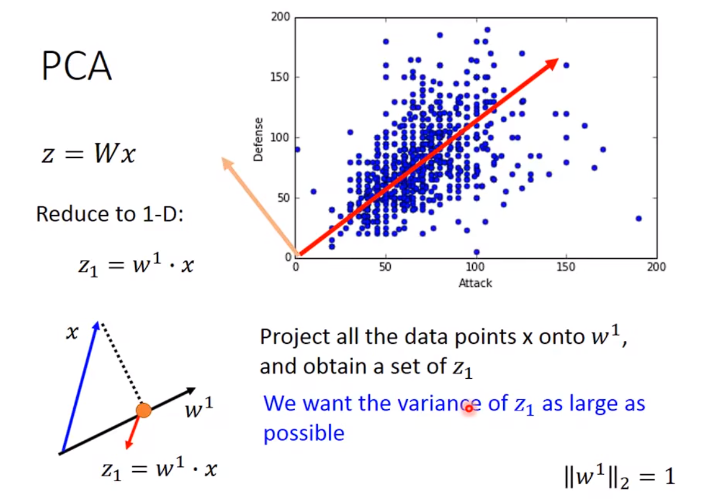
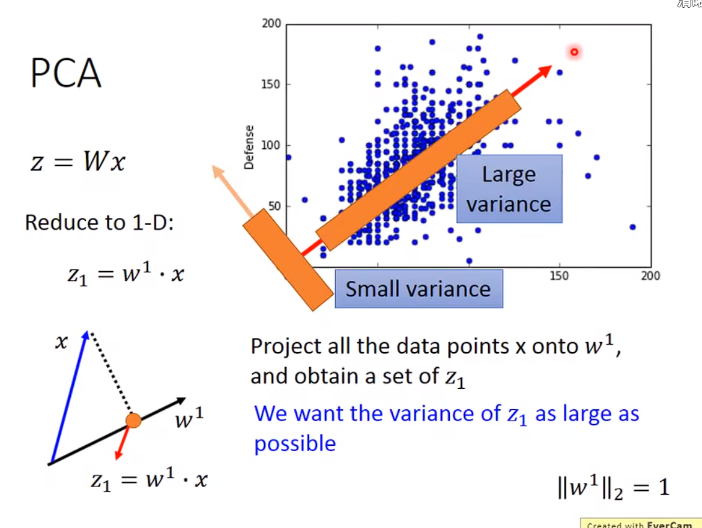

# Dimension Reduction
## Clustering & Dimension Reduction(化繁为简)

+ 把原本比较复杂的Input变成 简单的output
## Clustering
K-means
### HAC

+ 两两去计算相似度
+ 

## distributed Representation

+ 一个高维的东西 比如说图片，用他的特质来表示，这就是一种数据降维。
+ 

