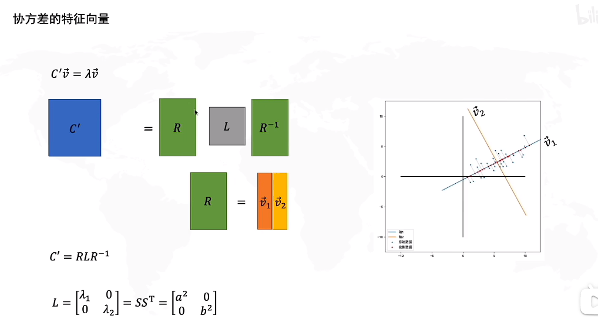
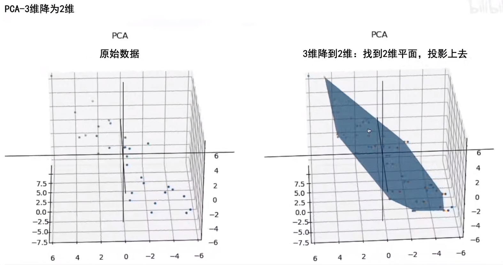

# PCA (Principal Component Analysis)
## 
+ 数据在原本坐标系的分布，改变坐标轴的原点(原本数据分布的中心?)，并选择坐标轴，找到一个合适的原点和坐标轴的旋转角度，使得坐标点都落在新坐标系的X轴上，
+ 这样我们就把二维的坐标点数据，变成了一维的坐标数据。
+ 

+ PCA就是为了找到一个坐标系，当只保存一个维度时，信息损失是最小的

## 做PCA的几个重要的点
+ 第一步：去中心化(把坐标原点放在数据中心)
+ 第二步：找坐标系(找到方差最大的方向)
+ 问题：如何找到方差最大的方向

## 做变换之后

+ 是否可以理解为，做变换之前x，y不相关，做了变换之后，x和y之间产生了相关性

### 拉伸决定了方差最大的方向是横或者纵

+ 拉伸扩大的方向 可以由中心点来确定
### 旋转决定了方差最大的方向的角度

+ 我们要求的就是：R，就是坐标系选择了多少度

## 怎么求R？
+ **协方差矩阵的特征向量就是R**
###
+ 什么是协方差
 
+ x与y之间按照上式计算，就是协方差
+ x和自己计算，就是方差

+ 正如上图，在白数据上。x与x的协方差为1,y与y的协方差为1，x与y之间的协方差为0，y与x之间的协方差为0。 

+ 由于S 和 R矩阵的特性
+ S = $S^T$
+ R = $R^{-1}$

+ v1是x轴旋转的方向
+ v2是y轴旋转的方向
+ 特征值1 就是$a^2$，就是x轴拉伸倍数的平方
+ 特征值2 就是$b^2$, 就是y轴拉伸倍数的平方

+ $ D^{'}$的协方差为 $C^{'}$, $C^{'}=RLR^{-1}$
+ 如果 $ R^{'}D^{'}$ 即$D^{'}$左乘$R^{'}$ 即是旋转回去， 旋转回去之后 协方差为$L$

+ 对于以上的例子
+ 特征向量为R矩阵 中的v1,v2
+ 特征值为S矩阵 
## PCA-3维 降为2维

## PCA与(标准差椭圆)置信椭圆有什么关系呢

+ s决定置信椭圆的大小
+ 我们画了这个圆 有百分之95的数据在这个圆内
+ PCA的缺点：离群点影响大 一个离群点就可以对PCA的结果造成很大的影响
+ **离群点影响大 一个离群点就可以对PCA的结果造成很大的影响**

 

