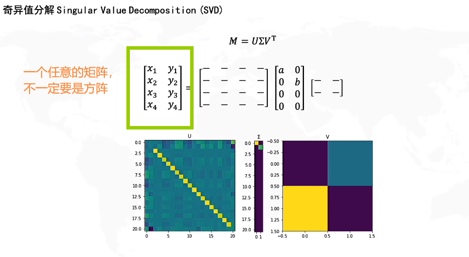
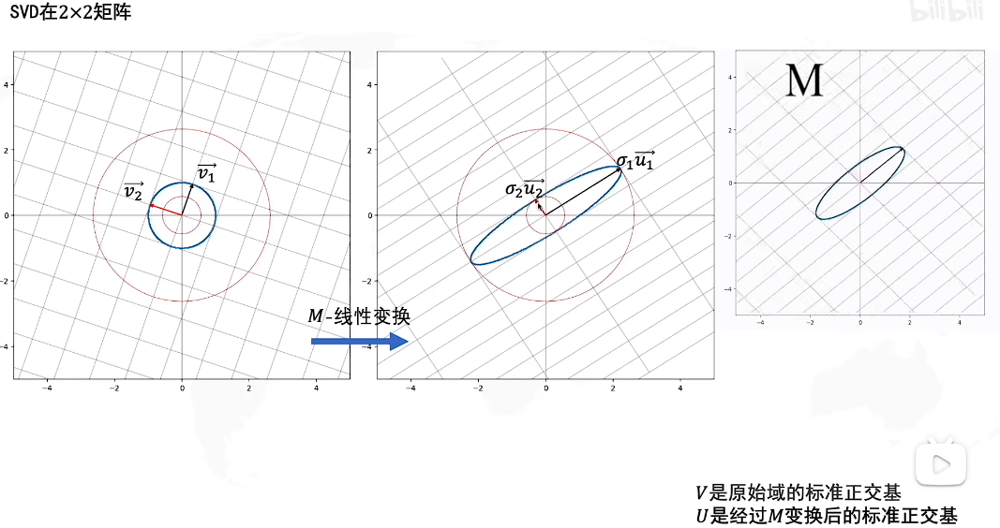

# 奇异值分解
## (Singular Value Decomposition,SVD)
```
以下资料来自于https://www.bilibili.com/video/BV16A411T7zX/?spm_id_from=333.337.search-card.all.click&vd_source=ba966217d93ed0858c8972cc7a95e1cf
```


+ M = U Σ $V^T$
+ U与V是两个方阵，Σ是对角线是奇异值，其他地方都是0填充

## 数据线性变换


+ D左乘S矩阵 进行拉伸变换


+ 一个正交的矩阵代表旋转
+ 一个对角矩阵代表拉伸
+ M这个变换，原本他既不是旋转也不是拉伸，但是我们可以把这个变换分解成，旋转和拉伸的组合。


+ V是原始域的标准正交基
+ U是经过M变换后的标准正交基

+ 原本的图像中拥有一组基 v1、v2,经过线性变换后，我们还期望找到一组基u1、u2他们仍然是垂直的


+ M =U Σ $V^T$可以理解为 
+ V左乘M 即[V1,V2]做M的线性变换得到 UΣ=[σ1u1,σ2u2]
+ UΣ = MV
+ M=UΣ$V^T$


+ 对角矩阵 Σ 奇异值在对角线上 从大到小排列
+ 因此可以去掉一行 奇异值比较小的

+ 只取前r个奇异值

## 奇异值分解的图像理解
+ 第一步

+ 第二步 U和V相乘 得到秩为1 的矩阵

+ 第三步 和奇异值相乘再合并


+ 第四步 可以把变换 拆出来 拆成3种模式的叠加

+ 右边的时空矩阵 可以用SVD分解成3个矩阵相乘
+ 比如先选择奇异值$σ_1$  我们可以得到模式1


+ 我们原本的时空矩阵等于第一种模式+第二种模式+第三种模式

+ 等于说我们可以把原本的时空矩阵 分解为几种重要的模式
+ 这三种模式，时间和空间的分布都是不一样的
+ 
# 如何求SVD分解


# 非负矩阵分解

+ S代表空间
+ B代表时间
+ SVD分解 在U、V矩阵之中可能会出现两个负值，对于这些负值很难去解释
+ 但是非负矩阵分解，就一定分解成两个正的，两个正的矩阵就比较好去解释其作用
+ 但这三种模式没有奇异值，你很难判断这三种模式的重要性，可以考虑求矩阵的范数去判断他们的大小，来决定他们的重要性
+ 