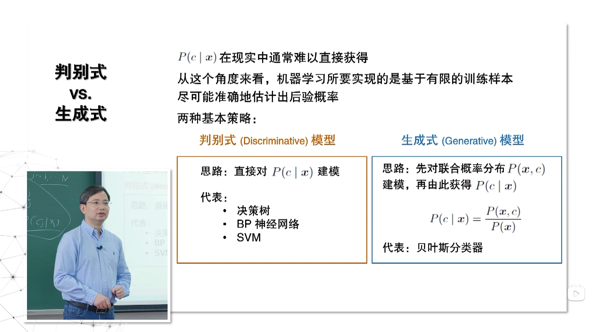
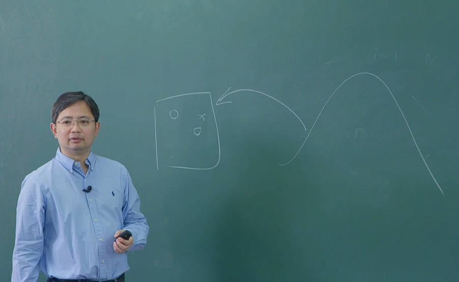
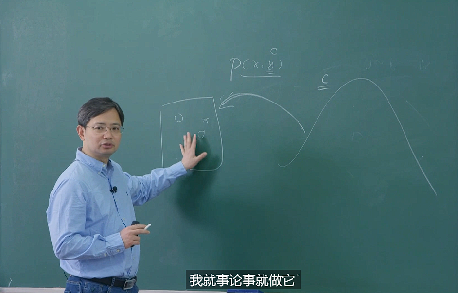
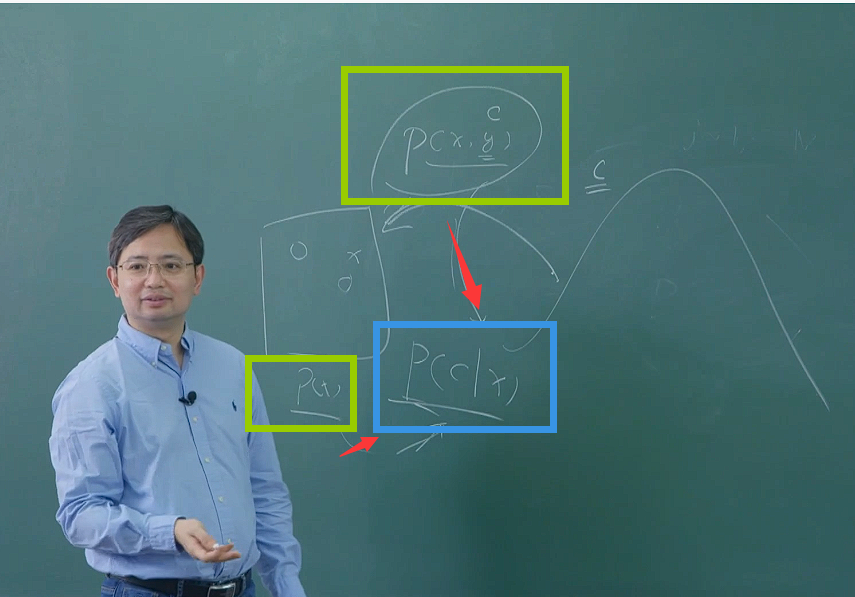
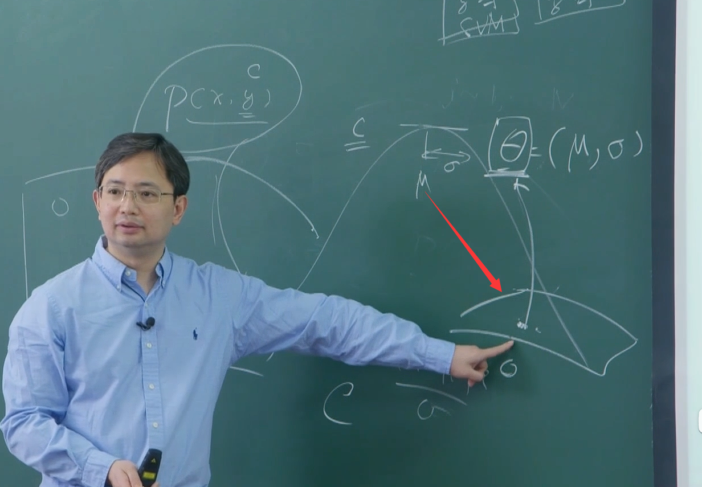
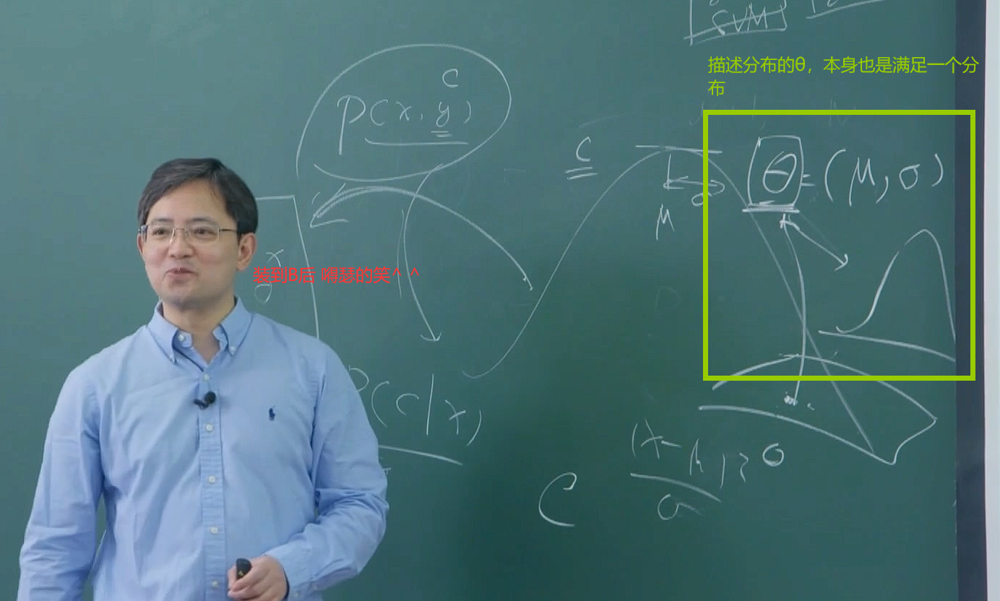
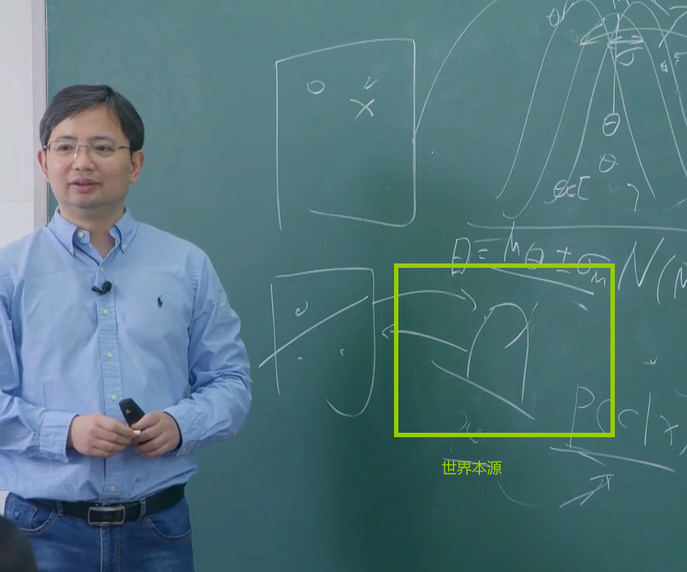

# 贝叶斯决策论
## 概率框架下实施决策的基本理论
+ 我们在现实世界中遇到的各种分析任务，在背后都可以使用贝叶斯决策论来分析他。
+

+ 我们得到的数据 都可以看做是从一个隐含的分布中，从该分布 得到一个采样。所以我们认为这些样本 都是独立同分布的。
+ 这个分布事先我是不知道的，但是你以后给我要预测的东西 也是从这来的。
+ 这样子的话 也就说明，我们一切的东西 都是从这个分布中生成出来的。如果我能把你原来的这个东西recover出来。那么你一切要基于数据 的问题。都可以解决了
+ 
## 判别式模型和生成式模型的区别

+ 判别式模型 基于已有的数据，我希望就事论事 只做数据。直接对P(c|x)进行建模，given x 基于P(x)P(c|x)=P(c)希望直接得到P(c)
+ 生成式模型 希望尽量的把分布c给弄出来。

 
## 机器学习有很多的流派，贝叶斯学习是其中一个很重要的流派
+ 从概率和统计的角度来说，机器学习有两大学派
+ 频率主义学派(统计学习)  such as:支持向量机
+ 贝叶斯主义(贝叶斯学习) 
+ 这两者有很大的区别

### 举个例子
+ 我们先有一些数据，我们假设这些数据是从一个高斯分布中得到的θ=(μ,σ) (谬，西格玛)
+ 根据我们observed的数据X ,假设我们认为C的原始分布就是一个高斯分布
+ 频率主义认为，θ是一个确定存在的东西，我们要做的就是把参数估计出来，依据我们拿到的数据，去把这个θ，在参数空间中确定出来
，那么依据这个参数，我们的模型就确定出来了，分布就知道了，问题就解决了。
+ 

+ 我们得到的一切，其实就是这一次我们得到的是这个θ，下一次 可能是这个分布中其他地方。 参数他本身也是一个分布。

+ 频率主义——点估计
+ 贝叶斯主义——分布估计

+ 贝叶斯分类器————只要是一个生成模型，并且使用了贝叶斯公式，那么他就是一个贝叶斯分类器。
+ 但贝叶斯学习————他一定使用了分布估计

+ “PRML 贝叶斯学习的角度 去诠释机器学习  把点估计当做分布估计的一个特例”
+ “在解决一个简单的问题的时候，引入中间过程，去解决了一个更难的问题，如果我们的数据 解决不了简单的问题。那么怎么去解决这个更难的问题呢？这种想法是错误的”

# 极大似然估计
+ 先假设这个数据符合某种概率分布形式，再基于训练样例对参数进行估计
+ 1、先假设这个分布是高斯分布
+ 2、假设样本出现的概率是独立同分布非常重要
+ 3、