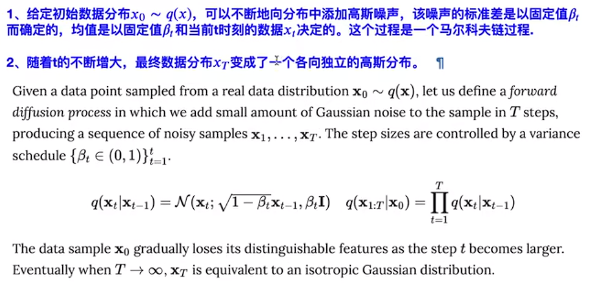

# Denoising diffusion probility models
## 条件概率的一般形式
 
## 基于马尔科夫假设的条件概率
 

## KL散度

## 重参数化技巧

# VAE
## 单层VAE的原理公式与置信下界

## Diffusion Model 图示

## 扩散过程推导(diffusion Process)

+ **这里的添加不是做加法 而是一个仿射变换的过程**
+ 随着T的不断增大，最终数据分布$X_T$变成了一个各向独立的高斯分布
+ 
+ 

## 李宏毅Diffusion课程

**“雕像其实本来就已经在大理石里面，我只是把不要的部分拿掉”：米开朗琪罗**

+ Denoise Model除了要输入 要被输入的那张图片，还要输入这是第几张图片。(即Noise严重的程度

## Denoise Model内部实际上是在干什么呢：

+ 1、Denoise Preidcter除了吃要还原的图片，还要吃一个步骤的数字。 输出一张噪声的图片，即预测出在这张图片中噪声应该长成什么样子。
+ 2、使用要还原的图片，减去预测出来的噪声，得到Denoise后的图片。Noise Predicter学习的是噪声。(学习这张图片中的噪声是比较简单的。直接端到端，学习加噪之后的猫，其实是非常困难的)
+ 

## 如何训练一个Noise Predictor

## Forward Process

+ 这样加噪之后，你就有Noise Predictor的训练资料了
+ Noise Predictor的训练资料就是这样一张加完噪声的图片

### Noise Predictor的训练资料
+ 这一张加完噪声的图片、现在是第几次加噪声  的共同输入
+ 加入的这个噪声就是现在network应该predict的输出，就是network要输出的ground truth

+ 输入加噪之后的输出+ step数
+ 输出模型predict的噪声数据

## 文生图

+ 文生图是需要有文字标识的训练资料的
+ 

+ 输入不仅仅是加噪后的图片，还包含一段文字的叙述。去把noise拿掉
+ 

+ 使得Noise Predicter多一段文字的输入。

+ 不仅仅要给加入噪声后的图片
+ 还有有step 的Id
+ 还要有文字的输入
+ noise predicter根据以上这三样 得到适当的Noise  (产生要去消掉的noise) (这个noise去和groundtruth进行对比)

## Stable Diffusion

**三个比较重要的model对于文生图**
+ Text Encoder  (一个比较好的文本嵌入)
+ Generation Model   (一个比较好的，中间生成模型, 生成压缩后的版本)
+ Decoder   (一个比较好的Decoder，从输出的图片的压缩版本，还原回图片)
+ 通常来说 这三个Model是分开训练，然后组合起来的

## Diffusion Model 数学原理剖析

+ diffusion 的add noise过程是不需要学习的。

## Training
+ Algorithm 1 Training
+ repeat 就是你一直做2~5行的事情，直到 converged.（diffusion model 文章中 将x0当做是干净的图片(真正的图，你要生成的图，)）
+ $x_0 $~q($ x_0$) 代表从图库中sample一张干净的图
+ 第三行 t ~ Uniform({1,....,T})  
代表从1-T中sample出一个整数t  （T往往是一个很大的数字 比如1000）
+ 第四行ε ~ N(0,I)  (sample a noise)采样一个噪声
+ 第五行Take gradient descent step on ▽ 

$ α_1,α_2....α_T$是由大到小的

由上式 $根号 (1-α )ε$  小t sample的越大，代表noise加的越凶狠,

+ 上式代表被noise之后图片，和sample到的数值t一起输入**Noisy Predictor** ，产生了一个noise
+ Noise Predictor 吃一个Noisy image 再吃一个数值t，预测一个Noise

+ Loss 函数如上，即 促使 训练出来的Noisy Predictor产生的Noise尽可能的和sample出来的Noise接近

疑问？
在加噪的过程中 就把Noise Predictor训练好了？

上述过程对应这个图。

## Inference

+ 在diffusion model中一般把$x_T当做一个完全都是噪声的图$
+ 第一行sample一个完全是噪声的图
+ 接下来进行**reverse process**把图产生出来,一共进行T次，
+ 再sample出来一个噪声z，
+ 

+ $ε_θ(x_t,t)$ 这个是训练好的noise predictor output出来的noise
+ $x_t减去新sample出来的噪声*系数，再加上噪声z 生成新图片x_{t-1}$
+ z是新sample出来的噪声。$σ_tz$表示一个新加的噪声
+ 以上操作如下图

## 影像生成模型的本质目标

+ 我们希望这个network，输入从某一个distribution sample出来的东西，通过这个network之后，他产生另一个distribution,这个distribution应该和另一个目标的distribution越相近越好，
+ 但是如何衡量 两个distribution越接近越好这件事情呢。(极大似然估计)

+ 第一步 收集一些图片，这个收集图片的过程就是sample {$x^1,x^2,x^3...x^m从P_{data}(x)中$} 
+ 我们先假设，我们生成某一张图的几率都是可以计算出来的，

+ 我们要找到一组参数θ，这组参数可以让这个式子的值最大.$ θ^* 意味着你把你收集到的每一张图$都拿去算生成这个图的概率，这个概率的总和最大。 

（你要找到一个θ让$x^1...x^m$产生出来的几率越大越好）

+ 这个让所有产生出来结果概率乘积最大的参数θ叫做$θ^*$
+ 
## Maximum Likelihood Estimation和让两个distribution越接近越好的关联性是什么

+ 由于原来的权重都为1，近似成利用data的分布(概率)做加权
+ 

+ 这里的都是高斯分布 但是均值为0的高斯分布 ，而不是标准高斯

+ 每一次加的Noise 都是从高斯noise中sample出来的，而不是一样的。

+ sample两次得到的distribution 等同于 sample一次
+ 

+ 所以说加噪是一次完成的

# 为什么要加重新sample加噪声
## 

