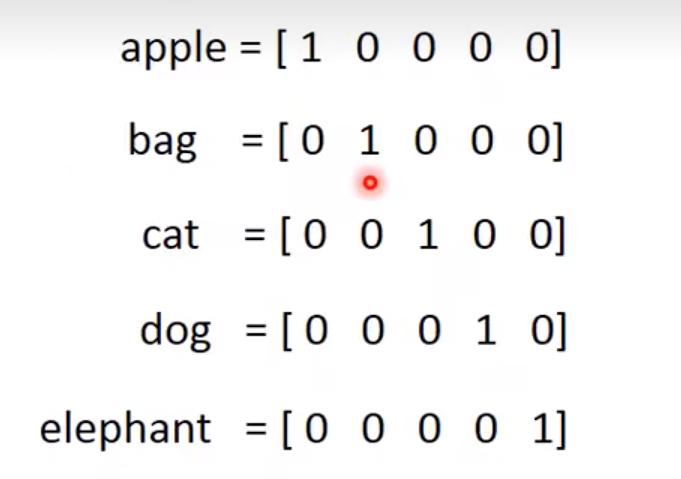
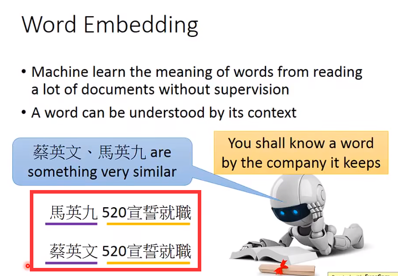
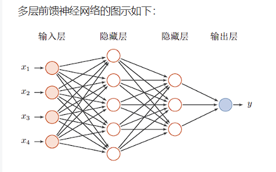
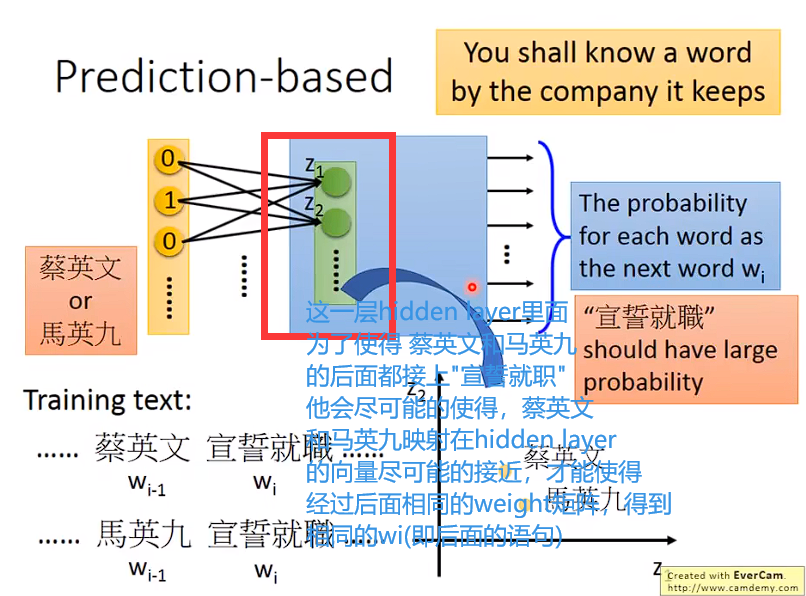
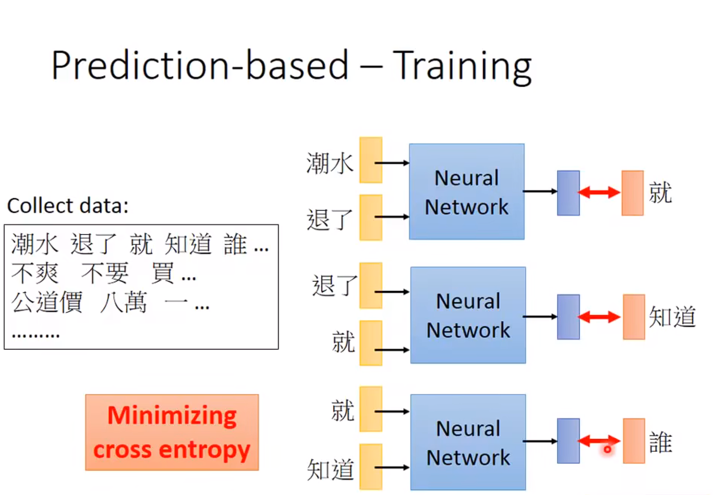
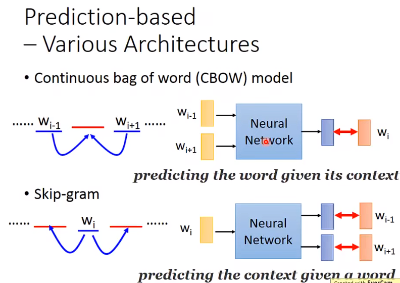
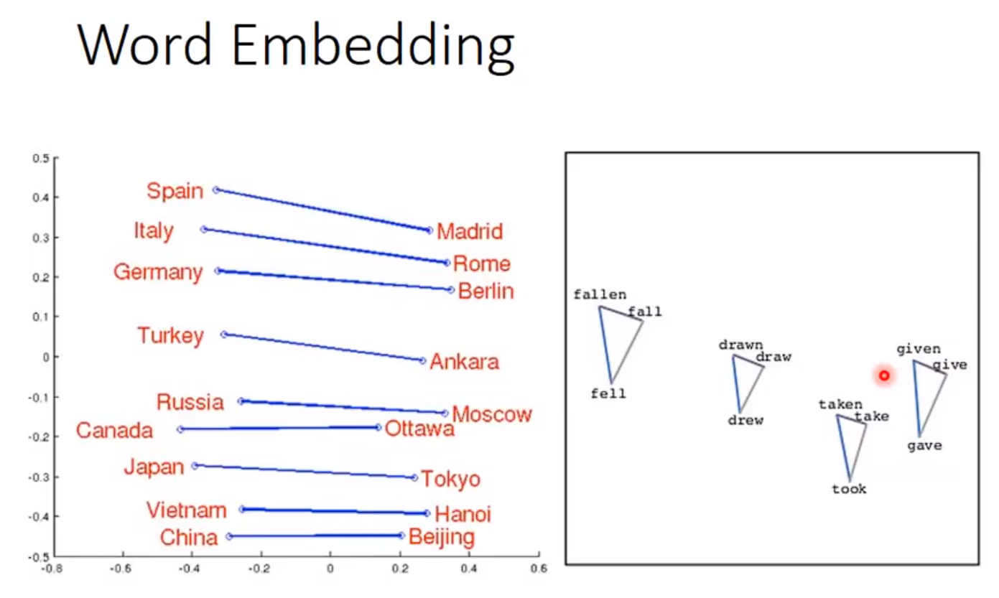
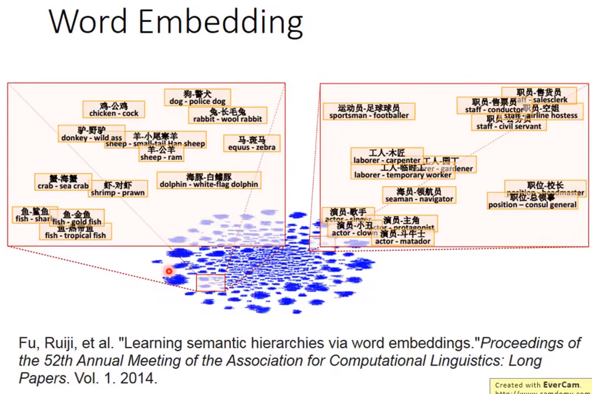
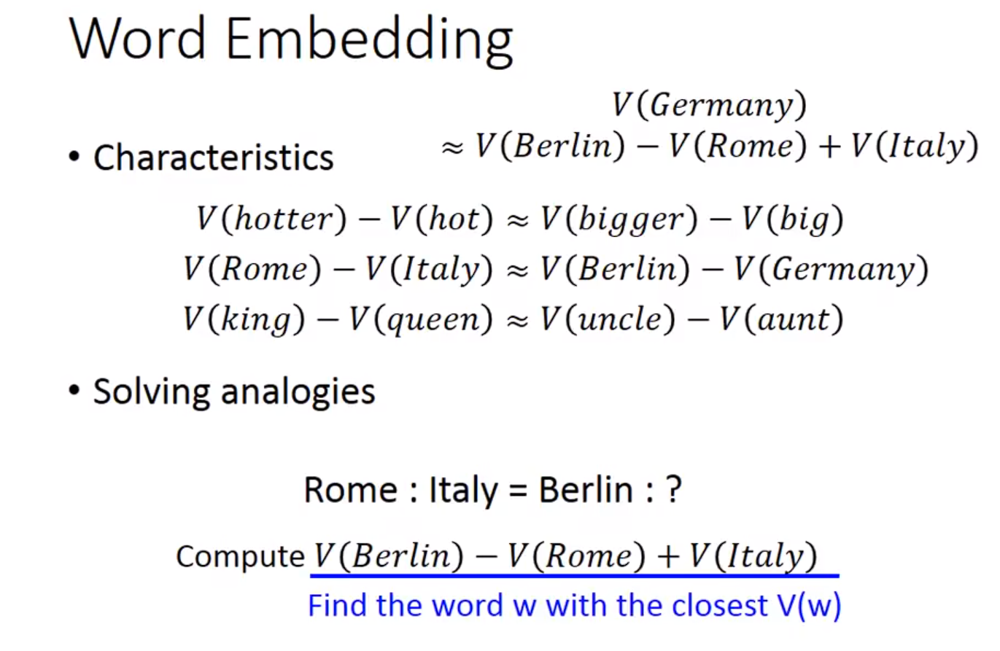
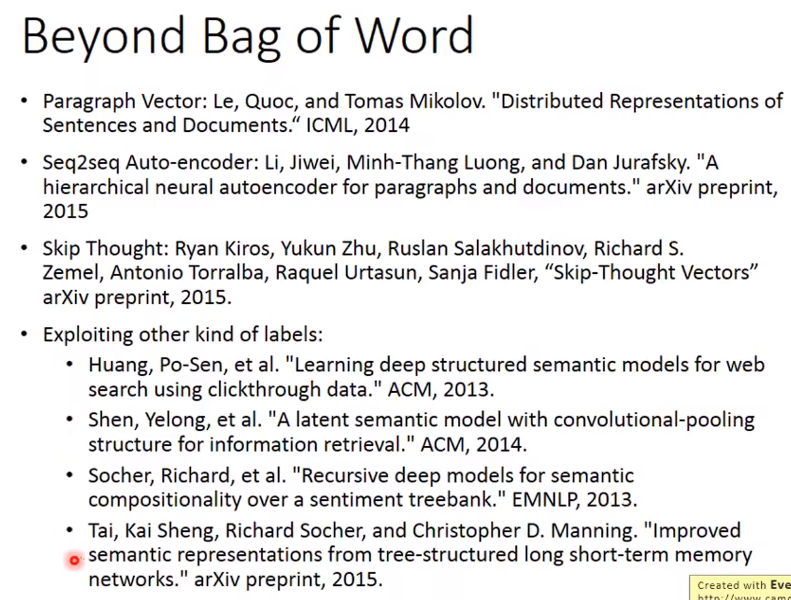

# Word Embedding
## 1-of-N encoding

 ```
 这样表示的vector一点都不Informative,比如说你完全无法知道
 Cat和Dog他们都是动物，和Cat 和 Bag之间的差距都相同
 ```

## Word Class
**Word Class的簇和簇之间的关联是无法得到体现的**

## Word Embedding
+ word Embedding 是一个unsupervised approach
+ 我们怎么让machine知道每一个词汇的含义呢？
+ 只需要让machine 阅读大量的文章，他就可以知道 每一个词汇它的embedding的feature vector是什么样子
+ 这是一个unsupervise learning
+ 学习word Embedding的关键 "一个词汇的理解是根据他的上下文来得到的" You shall know a word by the company it keeps
+ 




## Count based

## Predition based



```
使用前馈神经网络,输入 蔡英文 or 马英九 输出得到"宣誓就职"
取出第一层（Z1,Z2,Z3.....Zn）
可以得到 蔡（Z1,Z2,Z3.....Zn） 以及 马（Z1,Z2,Z3.....Zn）
输入蔡和马得到的两个向量会尽可能的相近，因为 为了使得
蔡和马 输入后 都得到宣誓就职，两个向量就会尽可能的接近，才能
使得后面的weight矩阵得到相同的输出！
```


~~~
在训练的过程中，你希望你的netword的output和旧的1-of-N encoding是Minimizing cross entropy的
~~~


### prediction-based model有种种的变体






### Bag of word
 
 


