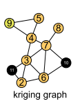
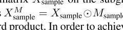

# IGNNK
1、Let [t1, t2] ={t1, t1 + 1, . . . , t2 − 1, t2} 表示一组时间点，[1,p]代表着历史周期
2、n代表传感器编号
3、用多元时间序列矩阵$X=R^{n \times p}
$表示可用数据

4、我们使用X作为training data

5、令[t, t + h] = {t, t + 1，…， t + h−1}是我们将进行克里金运算的周期



我们使用2-9号节点对{10,11}节点进行差值

## Subgraph signals and random masks(子图信号和随机掩码)
1、IGNNK第一步，使用随机抽样程序 生成一组用于训练的子图
(关键思想在于随机采样节点的子集以获得$X_{sample}$并且构建相应的邻接矩阵$W_{sample}$)
克里金问题与推荐系统中的应用非常不同,推荐系统中的拓扑只编码拓扑信息(比如：社交网络或共同购买网络)
但是我们的空间图中，基本是完全连通的。
其中，我们期望边权值随着一对节点之间的欧氏距离/行程距离而减少。
为了更好地表征“距离”的影响，我们简单地选择一个纯随机抽样方案来生成样本子图，而不是为每个节点创建一个本地子图。？？？？

2、我们创建一个掩码矩阵$M_{sample}$，以保持一些节点被观察到，并且测试为“未采样”。之后我们使用生成的掩码$M_{sample}$ 和邻接矩阵$W_{sample}$来训练一个GNN.

由于我们不能确切的知道测试节点的空间位置，为了使学习样本可以推广到更多的案例，我们还随机生成了$W_{sample}$.

3、输入数据$X_{sample}$本身可能包含缺失值，我们也将其标记为未知，这将使IGNNK能够在缺少数据的情况下执行空间插值。

# IGNNK的第一步
## 子图信号和随机掩码的生成 算法：
**需要：** 
一段时间内采样地点的历史数据$X_{[1,p]}$,  
参数：窗口长度h,每次迭代的样本量S，以及最大迭代次数$I_{max}$
```
for iteration = 1 : Imax do
    for sample = 1 : S do
        生成no + nm≤n的随机整数no(观察到的节点数)和nm(缺失的节点数)

```
# IGNNK的第二步
## GNN架构
IGNNK的第二步是训练一个GNN模型，在给定不完整信号的子图上重构完整矩阵$X_{sample}$

上述等式中的运算符 代表hadamard积。为了获得更高的预测能力，以往的研究主要是将GNNs与序列学习模型相结合。比如RNNs或TCNs,去捕获时空相关性，特别是长期依赖性。然鹅，对于我们的时空克里格任务，恢复窗口h相对较短。因此，我们简单地假设恢复窗口h中的所有时间点彼此相关，  
**并将长度-h信号建模为h特征**  
现实世界的空间网络通常用不对称距离矩阵来指导，为了表征空间和方向依赖关系的随机性，我们采用扩散图卷积网络(DGCNs) (Li et al. 2017)作为我们架构的基本构建块:
