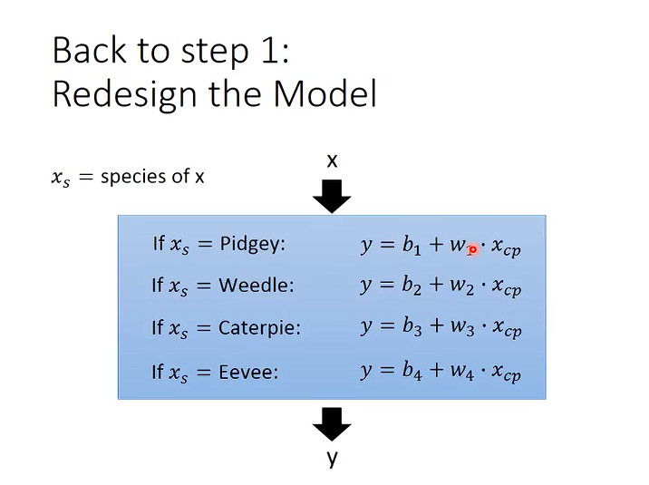
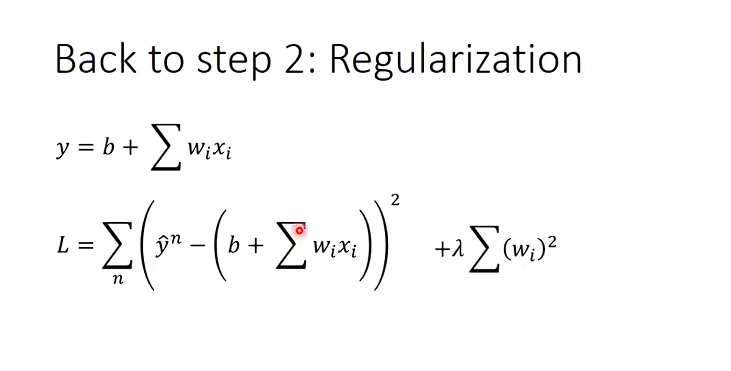

##

$X_i代表 feature$ 
 
$W_i代表 weight$    $b代表bias$  

$$
W^*,b^*=\arg \min_{w,b} f(x)
$$
```
上式子含义：穷举所有的w,b看哪个输入后可以让loss最小
```

## Gradient Descent

这个倒三角 就是
$\frac{\partial f}{\partial x}
$   

$$
\nabla L=
\begin{bmatrix}
\frac{\partial L}{\partial w}  \\ \\
\frac{\partial L}{\partial b} 
\end{bmatrix}
$$

$$
f^x=\arg\min_{x}f(x)
$$





## Regularization 正则化

```
加入正则化项 之后，曲线变得平滑。
```

因为优化loss fuction的同时，$\lambda \sum (w_i)^2$ 也趋于0
$w_i趋于0$导致$y=b+ \sum w_i x_i 曲线更加平滑，更不易受到噪声数据的影响$
更详细的去看 **岭回归！**
$\lambda $ 越大代表的曲线越平滑

```
Q：我们希望我们找到的function有多smooth呢？
A：你需要调整λ来决定你的function的平滑程度
```
```
下一堂课 validation??
```
## Validation
