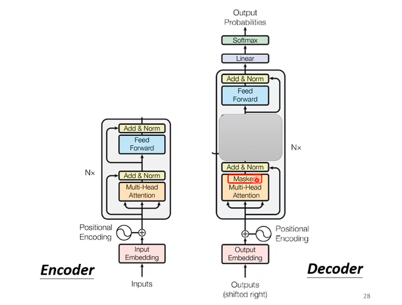

# Transformer
## Seq2Seq


## Seq2seq for Multi-label Classification
diff : Multi-class Classification

### Multi-class Classification 和 Multi-label Classification的区别


# Encoder


**Positional Encoding**

 # Decoder
 ## Autoregressive Decoder
```
One-Hot-Vector
```


+ 上一步的输出是下一步的输入


+ Mask的含义是什么


+ Mask的含义是啥
+ Mask Attention 和 Self-attention的区别是，我们现在不能再看，右边的部分


+ 比如说，我计算q_2我只让他和第一个k_1和k_2计算，而不让他去看k_3,k_4，


+ Why masked?
+ 可是是怎么去实现的呢  


## NAT Decoder
+ 不是自回归的decoder,而是直接输出一整个序列
+ 


## NAT


## Cross Attention
+ Encoder Decoder是如何互动的


# Training

+ inference 就是Testing


+ 我们希望softmax产生的这个概率分布 和 groundTruth的OneHot 编码的向量越接近越好。
+ 

+ 我们希望这四次分类问题 他总和起来的Cross Entropy越小越好

+ 训练的时候Teacher Forcing
+ 在测试的时候Decoder看到的是自己的输入
+ 

# Copy Mechanism
.


# Guided Attention
## 对ATTENTION增加限制


# Beam Search


# Exposure bias


