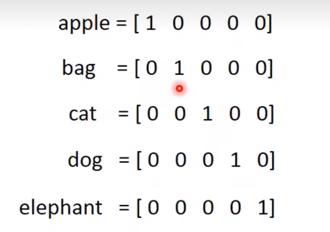

# Word Embedding
## 1-of-N encoding

 ```
 这样表示的vector一点都不Informative,比如说你完全无法知道
 Cat和Dog他们都是动物，和Cat 和 Bag之间的差距都相同
 ```

## Word Class
**Word Class的簇和簇之间的关联是无法得到体现的**

## Word Embedding
+ word Embedding 是一个unsupervised approach
+ 我们怎么让machine知道每一个词汇的含义呢？
+ 只需要让machine 阅读大量的文章，他就可以知道 每一个词汇它的embedding的feature vector是什么样子
+ 这是一个unsupervise learning