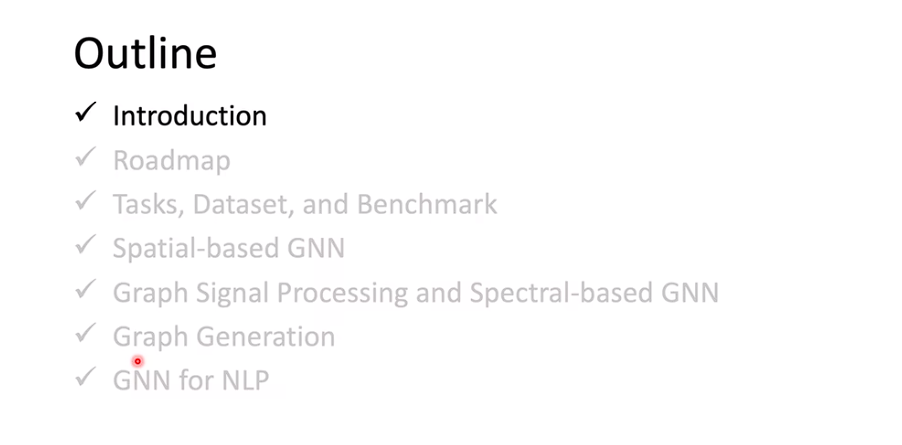
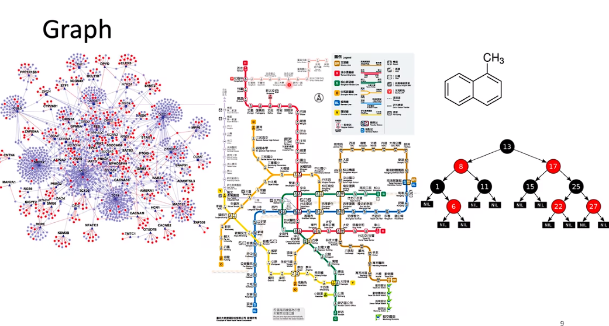
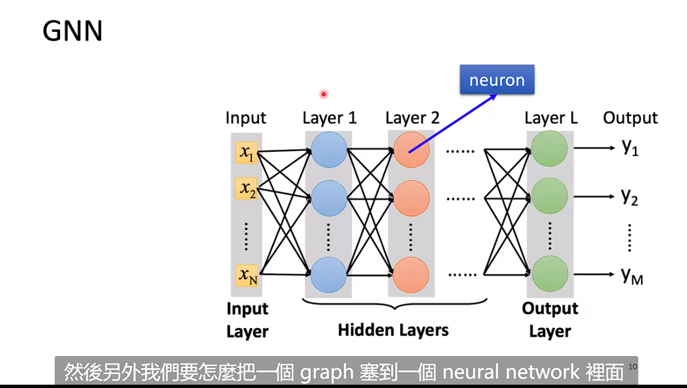
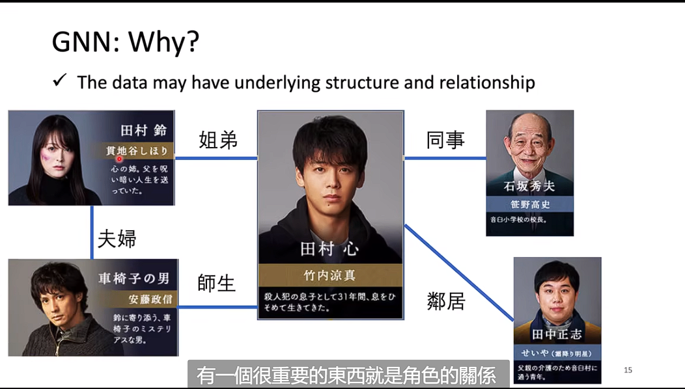
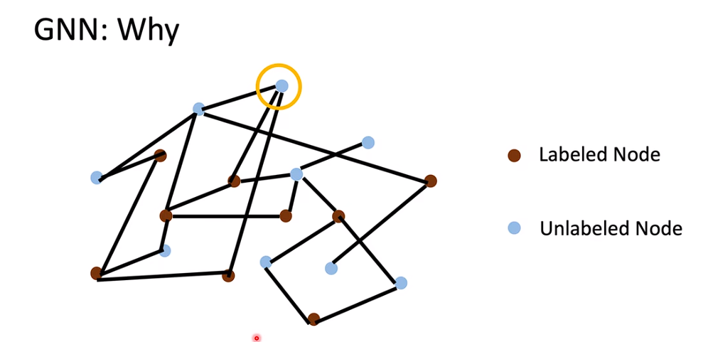
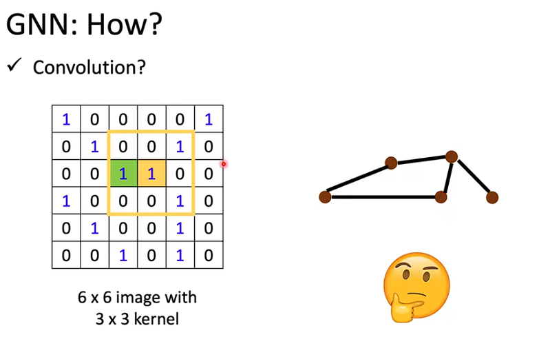
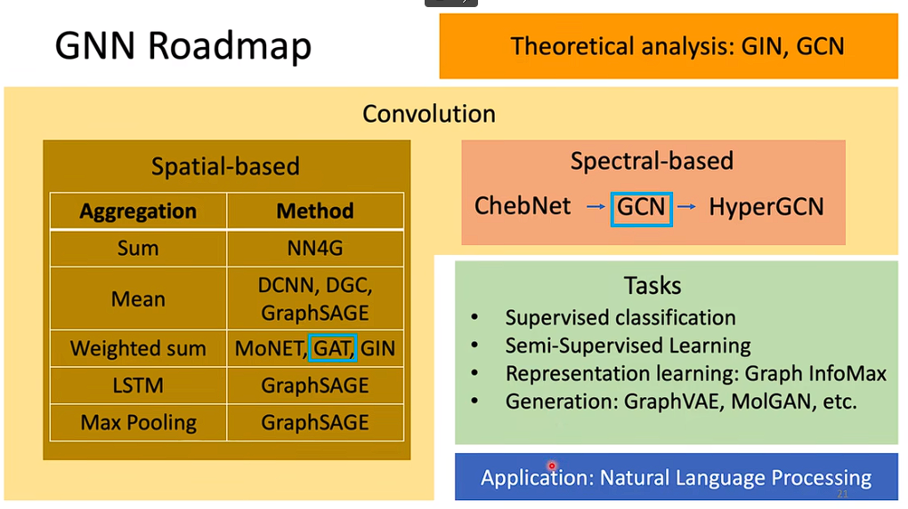
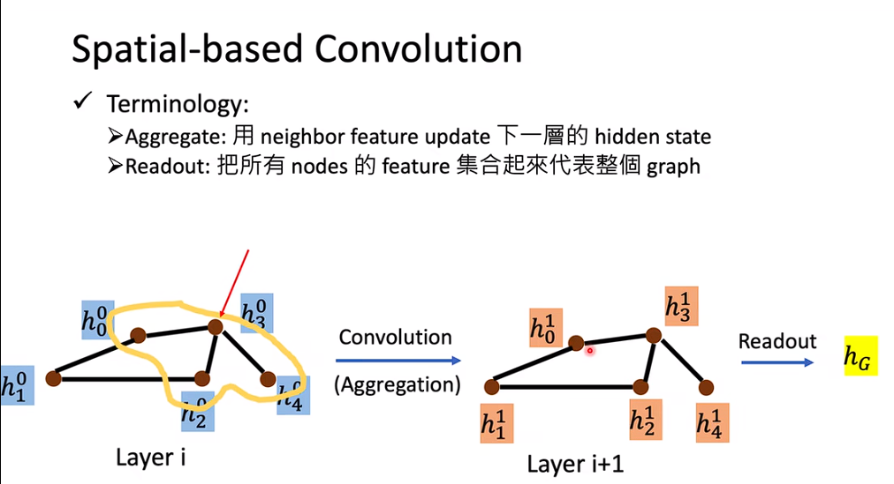

# GNN



```
1、我们要怎么把一个graph塞到neural network
2、我们的input和output都是一个graph
```





```
对于CNN 我们可以加入一个kernel然后给他做相乘相加，
Weigted sum的方式来做convolution,这似乎就不是那么容易。我们该如何把我们的node feature放到一个feature space里面。
```
```
1、Solution1:把卷积将邻居节点的类似的方法延伸到图中。
2、Solution2:用了传统的信号处理的那一套理论。
傅立叶域
1、基于邻接关系的卷积和基于频域的卷积
```



 ```
 https://www.dgl.ai/ Deep Graph Libray
```
时域卷积 等于 频域乘积


