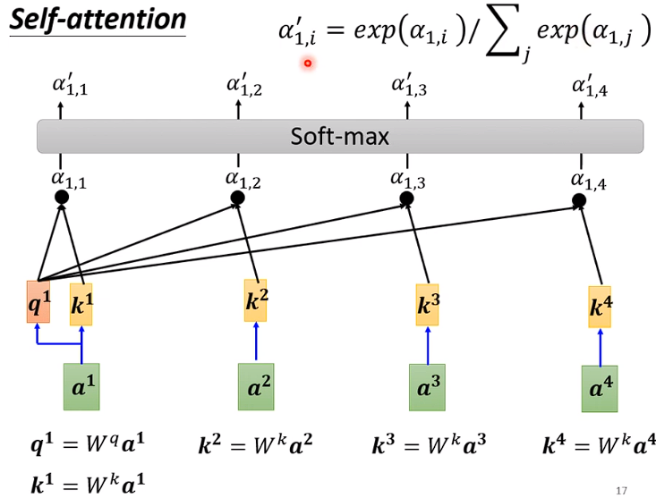
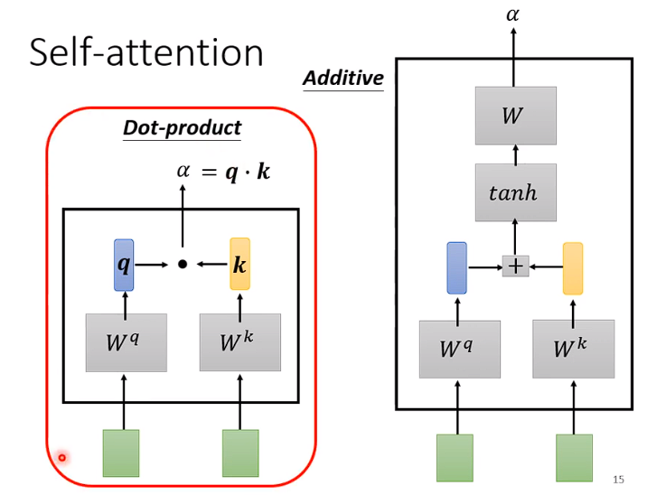
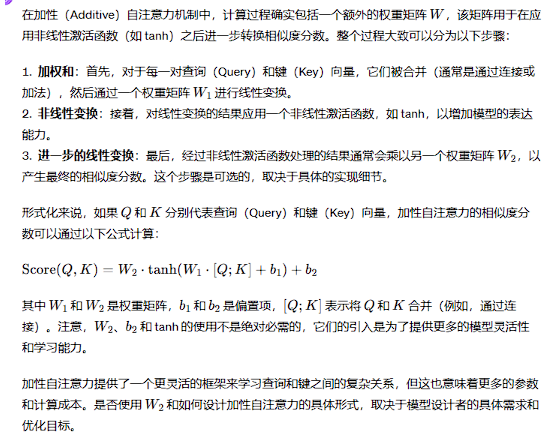
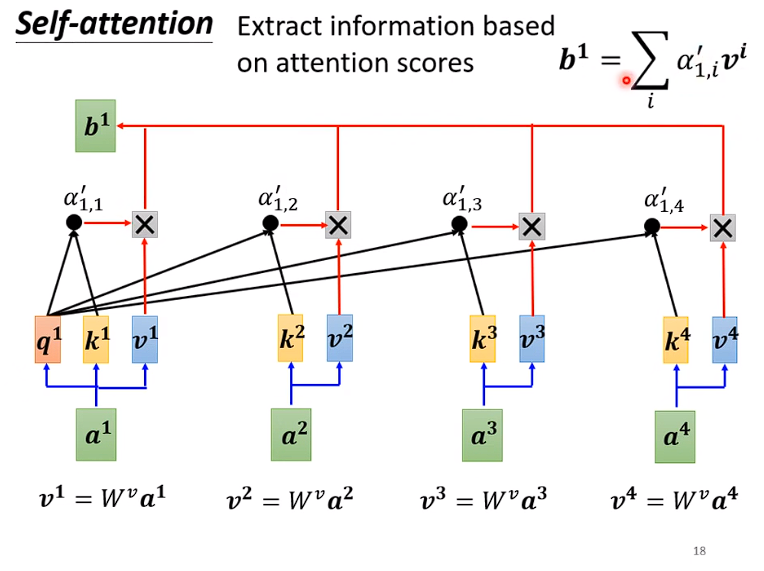

# Attention

❤️


```
a1...a4都是一个个的element(元素)
W都代表矩阵 a 代表向量  
```
$$
W^q a^1代表向量a^1乘以权重矩阵W^q,W^k a^2代表向量a^2乘以权重矩阵W^k
$$
$$
W^k a^2、W^k a^3、W^k a^4代表K^2,K^3,K^4
$$
分别将$ q^1与K^2、K^3、K^4$计算注意力Score，得到注意力分数$\alpha_1$,然后再经过Softmax得到$\alpha^1 $
```
这个地方用Softmax或者relu什么 activate fuction都可以
```

## 计算注意力分数


```
Dot-product 是将q与k点乘
一般来说用的都是这种
```

附件：(关于Additive)





将$a^1 a^2 a^3 a^4乘以 W^v 得到V^1，V^2，V^3，V^4 和注意力分数（经过softmax之后）相乘，然后相加得到b^1$ 
```
计算loss之后反向确定权重，最后得到，越重要的V所占的权重越大。
谁的Attention分数最大，谁就会Dominant你抽出来的结果
```


