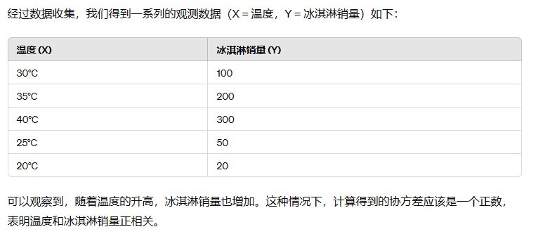
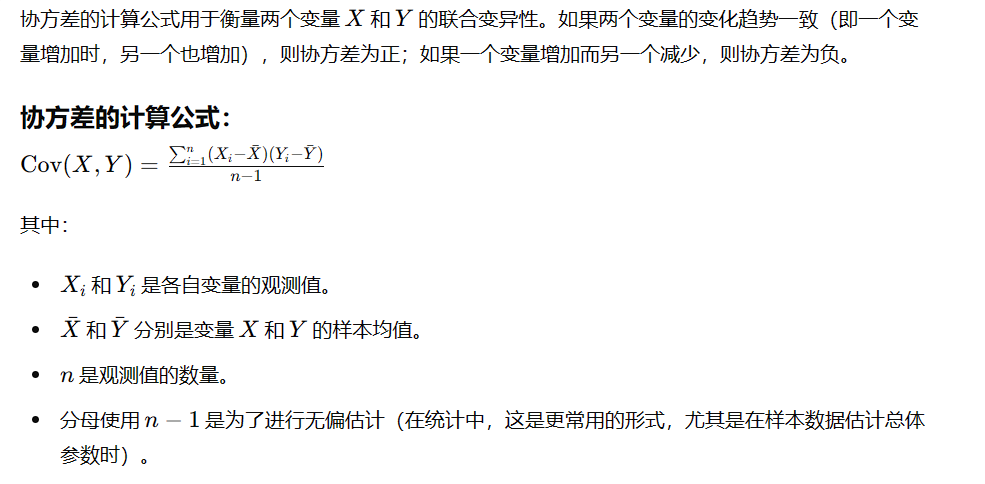
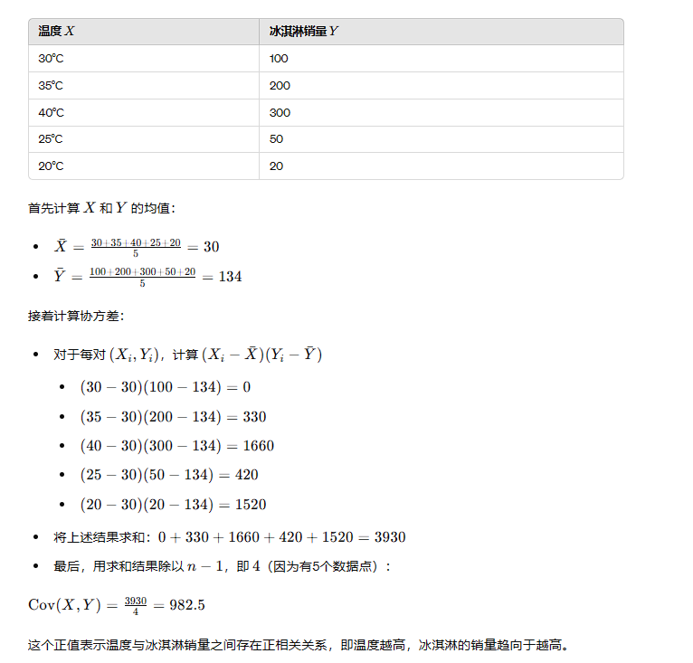
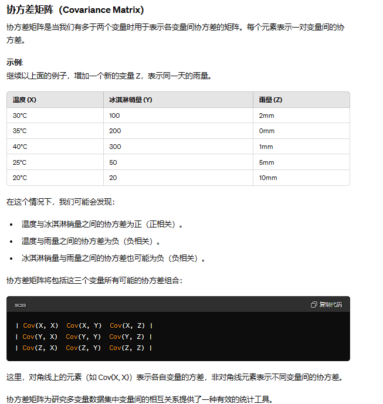

# 协方差、协方差矩阵、相关系数
## 协方差
```
协方差（Covariance）
协方差用于衡量两个变量之间的变动趋势是否一致。如果两个变量的协方差为正，表示一个变量增加时，另一个变量也倾向于增加；如果协方差为负，则表示一个变量增加时，另一个变量倾向于减少。
```
+ 示例
+ 假设有两个变量 X 和 Y
+ X 表示某城市每天的最高温度。
+ Y 表示同一天该城市的冰淇淋销售数量。



### 协方差的计算


## 协方差矩阵

