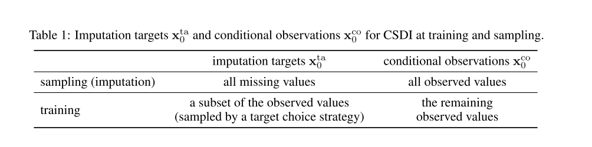

# CSDI
## Conditional Score-based Diffusion Models for Probabilistic Time Series Imputation
## Abstract
```
background:
时间序列缺失值的插补在医疗保健、金融领域很多应用
Now:
目前基于分数的扩散模型。表现要优于自回归模型，有望应用于时间序列的插补
Our:
我们提出了 基于条件分数的扩散模型的新型时间序列插补方法，条件扩散模型被明确地训练用于插补，并且可以利用观测值之间的相关性
```


+ 与现有的基于分数的扩散模型不同，反向过程可以将观测值(在图的左上角)作为条件输入，允许模型利用观测值中的信息进行去噪。
+ 我们利用注意机制来捕捉时间序列的时间依赖性和特征依赖性。
+ 为了训练条件扩散模型，我们需要观测值(即条件信息)和真值缺失值(即imputation目标)。然而，在实践中，我们不知道真实缺失值，或者训练数据可能根本不包含缺失值。然后，受掩模语言建模的启发，我们开发了一种自监督训练方法，将观测值分离为条件信息和imputation目标。我们注意到CSDI是为一般的imputation任务而制定的，并不局限于时间序列的imputation。
+ 从图中可以看到conditional obervation $X{_0^{ta}}$ 为true_data*gt_mask
+ $x{_T^{ta}}$为 target_data+noise
+ 我们从图左侧的随机噪声开始imputation，并通过条件扩散模型的反向过程pθ逐渐将噪声转换为可信的时间序列。在每一步t，反向过程从前一步(t + 1)的输出中去除噪声。与现有的基于分数的扩散模型不同，反向过程可以将观测值(在图的左上角)作为条件输入，允许模型利用观测值中的信息进行去噪。
+ 说人话就是 加入了观测序列作为条件信息
+ 我们利用注意机制来捕捉时间序列的时间依赖性和特征依赖性。

# 我们的主要贡献如下:
+ 我们提出了基于条件分数的扩散模型用于概率插补(CSDI)，并将其应用于时间序列插补。为了训练条件扩散模型，我们开发了一种自监督训练方法。


# Related works
+ 扯扯之前人都干了点啥
```
以前的研究表明，深度学习模型可以捕获时间序列的时间依赖性，并且比统计方法提供更准确的imputation。一种使用深度学习的流行方法是使用rnn(包括lstm和gru)进行序列建模[17,8,7]。随后的研究将rnn与其他方法相结合，如GANs[9, 18, 19]和自训练bb0，以提高imputation性能。其中，rnn与注意机制的结合在时间序列的imputation和interpolation方面尤为成功[21,22]。虽然这些方法侧重于确定性的imputation，但GP-VAE[10]最近发展成为一种概率的imputation方法。
```
# Background
+ 多元时间序列插补

+ s是个什么玩意

# 使用diffusion model进行插补
+ 让我们考虑一般的imputation任务
+ 给定一个包含缺失值样本$x_0$,我们生成插补的目标$X{_0^{ta}}$ 
+ 

# CSDI
```
在本节中，我们提出了一种新的基于条件分数的扩散模型的imputation方法CSDI。条件扩散模型允许我们利用观测值中的有用信息进行准确的估算。我们提供了条件扩散模型的逆向过程，然后开发了一种自监督训练方法。我们注意到CSDI并不局限于时间序列。
```
## Imputation with csdi


## Training and Sampling 的区别


## 


##
```
import torch
import torch.nn as nn

class TemporalTransformer(nn.Module):
    def __init__(self, num_channels, num_heads):
        super(TemporalTransformer, self).__init__()
        self.transformer = nn.Transformer(d_model=num_channels, nhead=num_heads)
    
    def forward(self, x):
        # x: (1, L, C)
        x = x.permute(1, 0, 2)  # (L, 1, C)
        x = self.transformer(x, x)
        x = x.permute(1, 0, 2)  # (1, L, C)
        return x

class FeatureTransformer(nn.Module):
    def __init__(self, num_channels, num_heads):
        super(FeatureTransformer, self).__init__()
        self.transformer = nn.Transformer(d_model=num_channels, nhead=num_heads)
    
    def forward(self, x):
        # x: (K, 1, C)
        x = x.permute(1, 0, 2)  # (1, K, C)
        x = self.transformer(x, x)
        x = x.permute(1, 0, 2)  # (K, 1, C)
        return x

# 示例张量
K, L, C = 10, 20, 30
X = torch.randn(K, L, C)

# Temporal Attention
temporal_transformer = TemporalTransformer(num_channels=C, num_heads=5)
X_temporal = X.permute(1, 0, 2).contiguous().view(1, L, C)  # (1, L, C)
X_temporal = temporal_transformer(X_temporal)

# Feature Attention
feature_transformer = FeatureTransformer(num_channels=C, num_heads=5)
X_feature = X.permute(0, 1, 2).contiguous().view(K, 1, C)  # (K, 1, C)
X_feature = feature_transformer(X_feature)

```

## 两个都输入x代表 编码器和解码器的输入都相同
+ Transformer 被用作一个自编码器结构。下面是详细的解释，包括原因和效果。


## Side information
```
除了给出的参数之外，我们还提供了一些侧面信息作为模型的额外输入。首先，我们使用s = {s1:L}的时间嵌入来学习时间依赖性。根据之前的研究[29,30]，我们使用128维时间嵌入。其次，我们利用K个特征的分类特征嵌入，其中维度为16。
```
## Experimental results


## Results of probabilistic imputation
+ 消融实验
+ 此外，我们将CSDI与使用无条件扩散模型的imputation进行了比较，以显示条件模型的有效性(参见附录C，使用无条件扩散模型进行训练和imputation)。
+ 