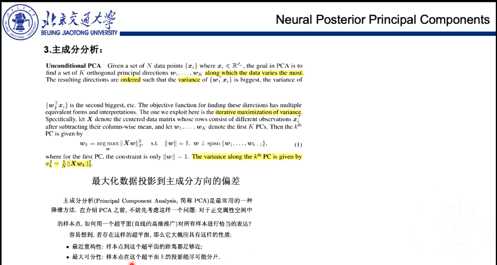
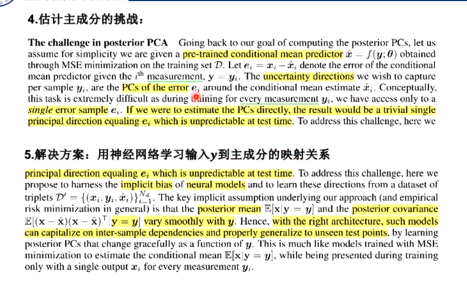
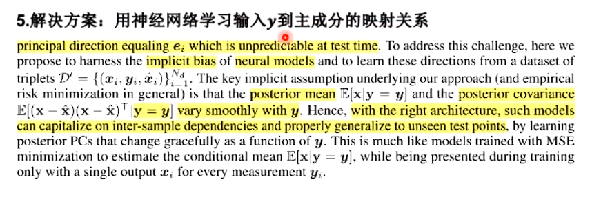
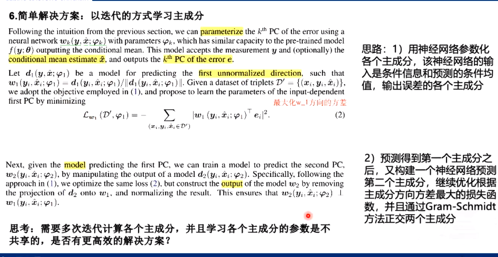
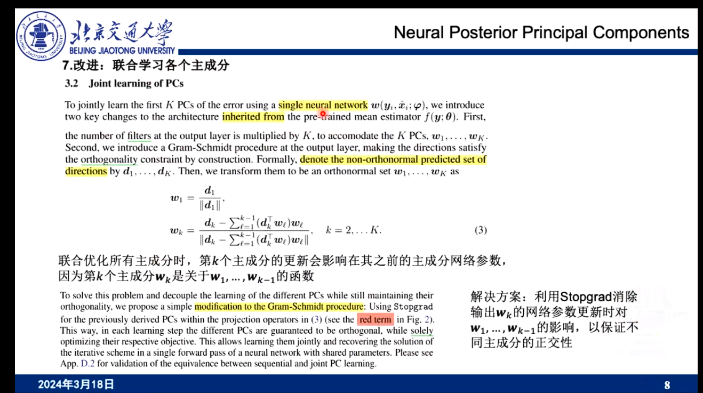
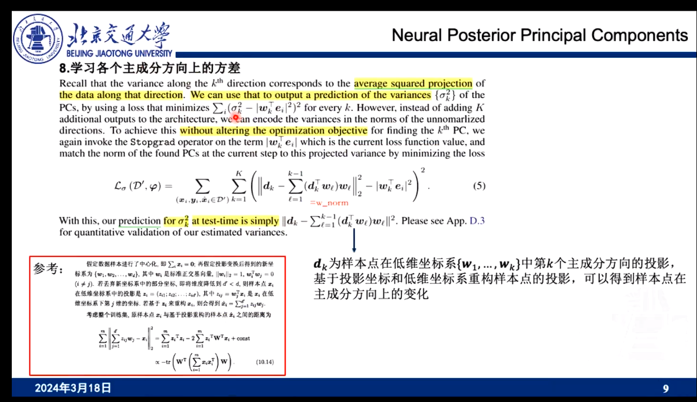
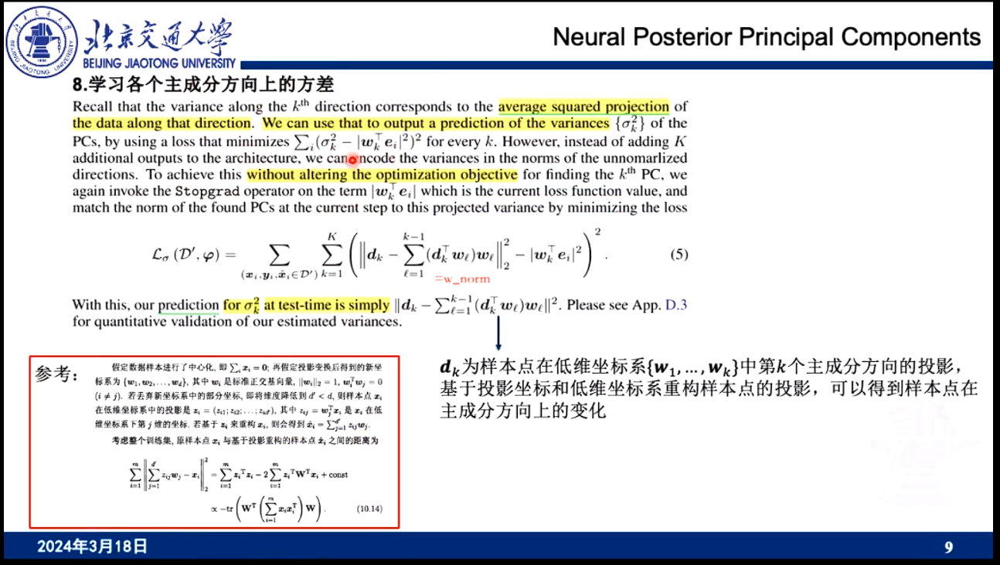

# 
## 基于sample的方法和基于主成分分析的方法之间有很大差异
+ 生成模型，基于各个像素点独立的分别来量化不确定性，偏差有可能会扩大
+ 真实的误差应该主要分布在主成分的方向上
+ 在主成分的方向上 更能够描述这个数据的波动
而不是以一个整体作为参照，如果以整体作为参照，不确定性可能会扩大，他可能会引入一些噪声
+ 他在主成分分析上。可以更加精细的刻画，而且他能够考虑不同像素点之间的相关性
+ 后面会讲他是如何考虑相关性的

## + 主要解决之前方法的两点Limitation 
+ sample的效率很低，基于主成分分析的方法可以直接输出他的一个不确定性
+ 基于sample的方法 各个像素点之间独立，他并不能很好的刻画像素点之间的关系。这一点对于不确定性量化是非常重要的。

+ 
## 高斯协方差近似 Gaussian covariance approximation
+ 来量化 各个像素点之间依赖的方法。？？？对于我的误差 做一个二范数，可以得到关于误差各个像素点之间误差的一个协方差矩阵？？？深度学习方法去拟合协方差矩阵
+ 
## 量化不确定性 1、数据不确定性 2、模型不确定性
+ 这里主要讲了模型不确定性
+ 模型可以估计参数值的后验概率分布，根据观测值，更新对于参数值的一个估计 example:Markov Chain Monte Carlo,Monte-Carolo Dropout
+ 普通的卷积，聚合信息，和NPPC都可以聚合信息，得到一个confindece intervel,(我的理解是，在确定confidence intervel时，两种方法都考虑了空间相关性，但是在确定整体的不确定性时，普通的cnn只是用两个confindce intervel，分别去进行采样估计，而忽略了考虑两个空间之间的相关性)

## 变量定义
1、x是我要恢复的图像

2、y是一个条件信息，或者说是一个带噪声的信息

## 解决思路
+ 我可以构建预测值和真实值之间的一个协方差矩阵、基于协方差矩阵，可以得到这个协方差矩阵的前K个特征向量
+ 这个特征向量正交之后可以把他们看做是主成分？？
+ 这个主成分就描述了 这个图像他可能变化的一个方向
+ 但是协方差矩阵和特征值的计算就是很耗费计算量的
+ 

+ 机器学习这本书里面也证明了，基于最近重构性和最大可分性，在这个平面上殊途同归，得到的主成分都一样的
+ 最近重构性：样本点到这个超平面的距离都足够近
+ 最大可分性：样本点在这个超平面上的投影都能尽可能的分开
+ ？？？在不同主成分上的一个误差

# 估计主成分的误差
+ 估计主成分，挑战：得到PCs的误差，我得到一个样本，同时我可以预测一个样本，我使用预测的样本和他真实的label来算一个误差，但是这样的是无法扩展到测试集的，我对于未见过的值,我还是只能得到一个预测值，然后去做一个特征值分解。
+ 我们还是希望给定一个输入，然后去预测他的主成分？这点作者觉得还是很难的。(给定一个样本，去估计他的主成分)
+ 

+ 最大可分性
+ 误差在第一个主成分方向是最大的
+ 误差是可以得到的，他的主成分就相当于是预测值

+ ？？？首先得到一个未正交化的一个向量，从哪得到的？

+ 先预测第一个主成分方向 再去预测第二个主成分方向，他需要保证，第一个主成分方向和第二个主成分方向是正交的
+ 使用Gram-Schimidt来正交两个主成分
+ 但是这样需要多次迭代计算各个主成分，并且学习各个主成分的参数是不共享的，是否有更高效的解决方案，直接得到各个主成分

+ 

