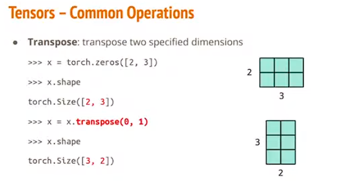
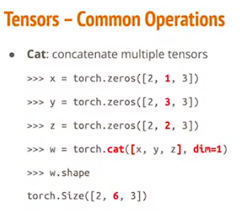
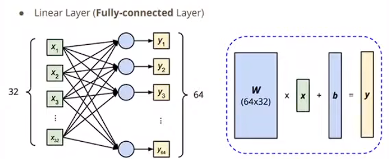
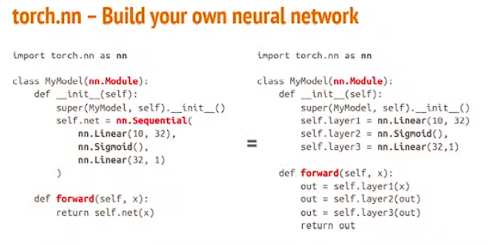
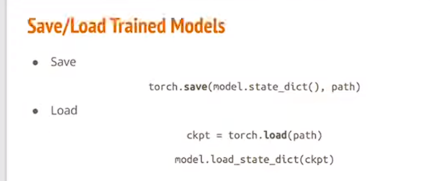

# Pytorch
## 基本运算
```
加法
z=x+y
减法
z=x-y
log
y=x.pow(2)
求和
y=x.sum()
取平均
y=x.mean()
```
## Transpose
```
Transpose:transpose two specified dimensions
x=torch.zeros([2,3])
x=x.transpose(0,1)
x.shape  >>>  torch.Size([3,2])
```

## Squeeze
```
remove the specified dimension with length = 1
>>> x = torch.zeros([1,2,3])
>>> x.shape

x.squeeze(0)
删除掉第一维变为[2,3]

x=x.unsqueeze(1) 在第二维，为其新增一维
torch.Size([2,1,3])
```
## Cat


```
沿着第二维进行合并，其他维度需要保持一致
```
**需要有什么操作，可以先去看pytorch的官方文档**
```
中文：https://pytorch-cn.readthedocs.io/zh/latest/package_references/torch-nn/
英文：https://pytorch.org/docs/main/
python面向对象编程:https://www.runoob.com/python/python-object.html
LaTex在线编辑器：https://www.latexlive.com/##
```
## CUDA(GPU)
```
torch.cuda.is_available()
```
## Torch.nn
+ **Linear layer**

nn.Linear(in_features,out_features)



## torch.optim
```
optimizer = torch.optim.SGD(model.parameters(),lr,momentum=0)
For every batch of data:
1.Call optimizer.zero_grad() to reset gradients of model parameters.
2.Call loss.backward()to backpropagate gradients of prediction loss
3.Call optimizer.step() to adjust model parameters.
```
```
for epoch in range(n_epochs):
    model.train()
    for x,y in tr_set:
        optimizer.zero_grad()
        x,y=x.to(device),y.to(device)
        pred=model(x)
        loss=criterion(pred,y)
        loss.backward()
        optimizer.step()
```
## Model Load和Save


