# Transformer
## Seq2Seq
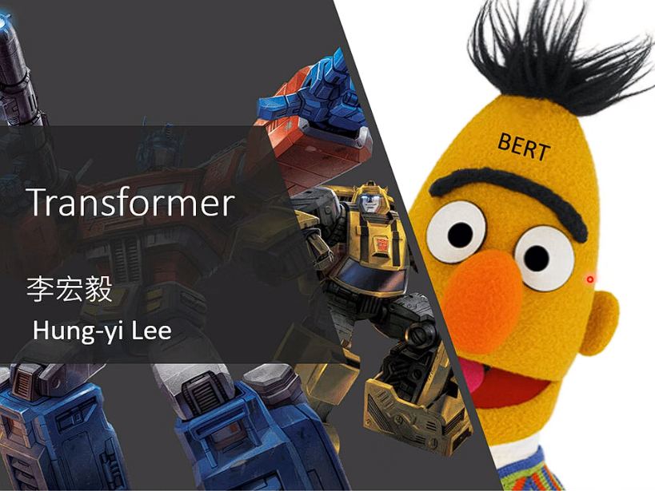

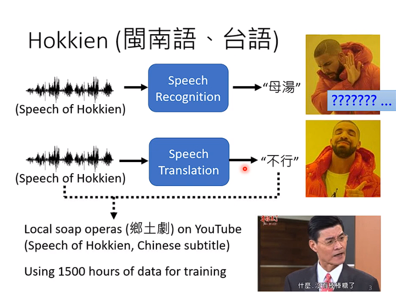

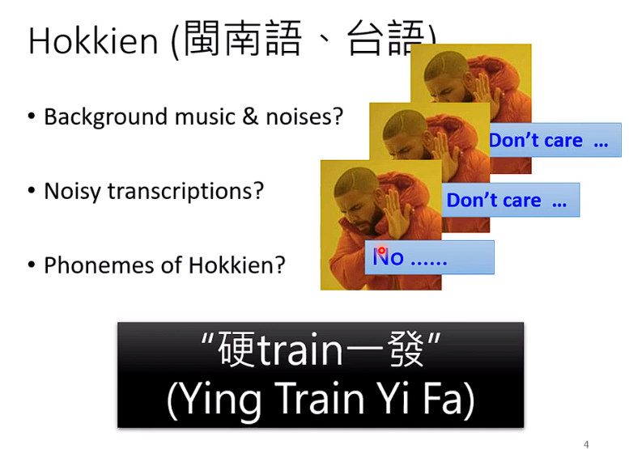

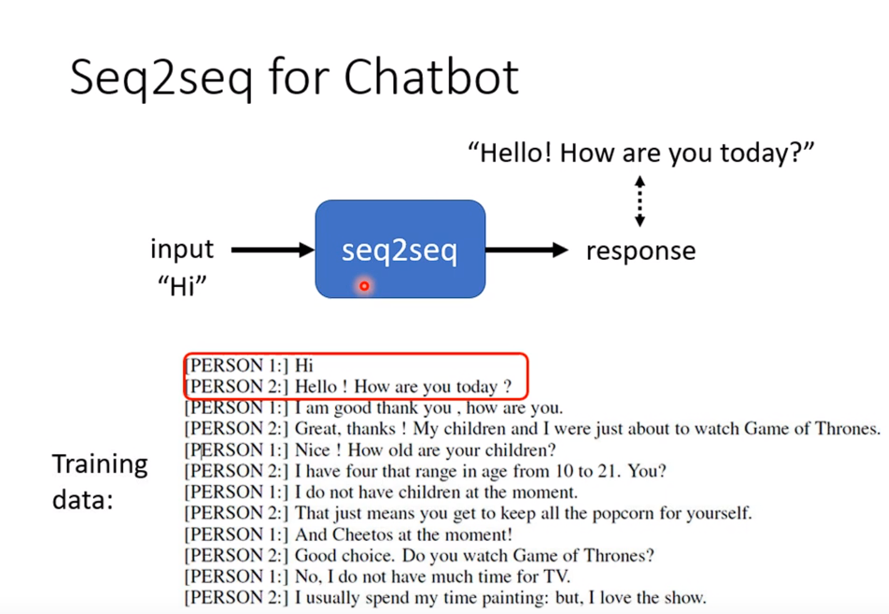

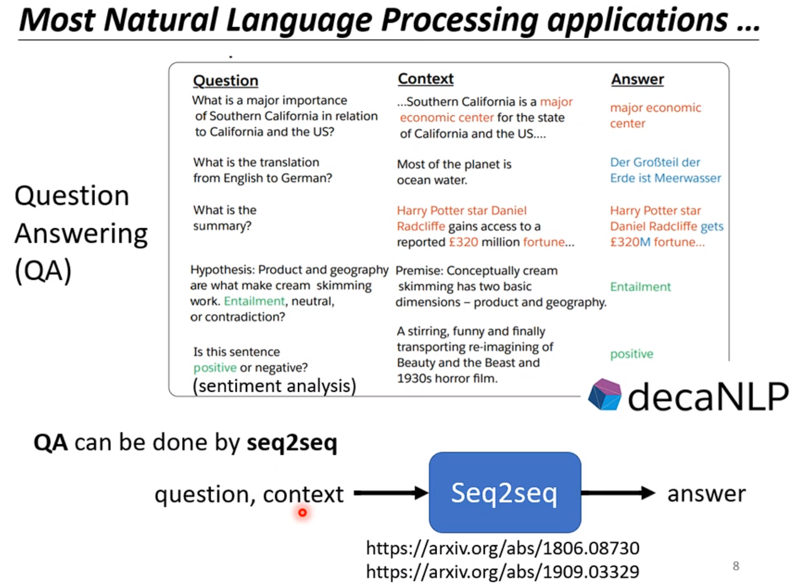

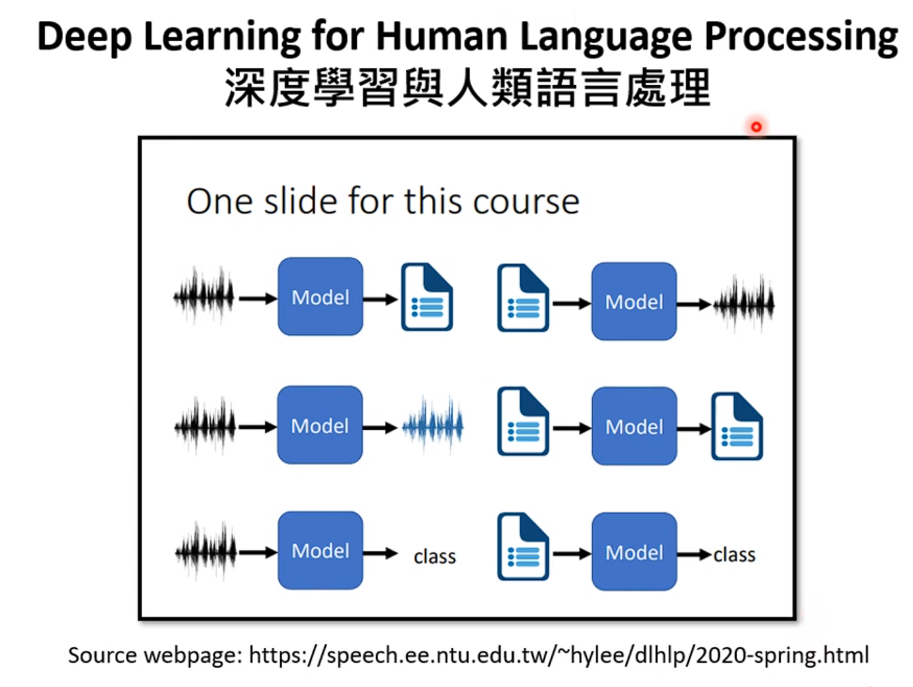

## Seq2seq for Multi-label Classification
diff : Multi-class Classification

### Multi-class Classification 和 Multi-label Classification的区别
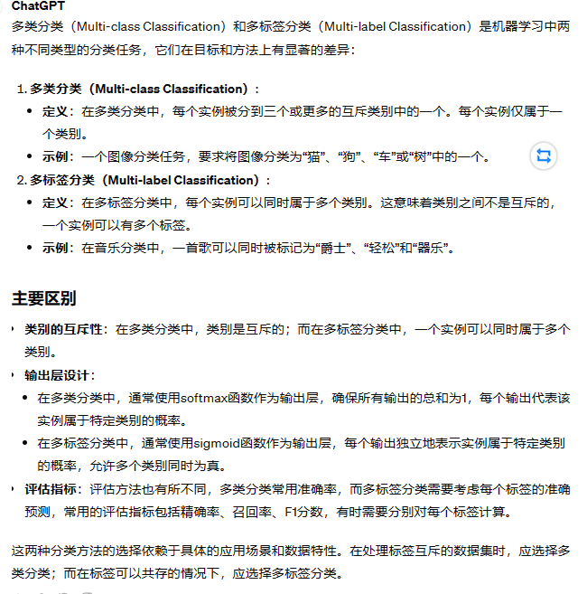

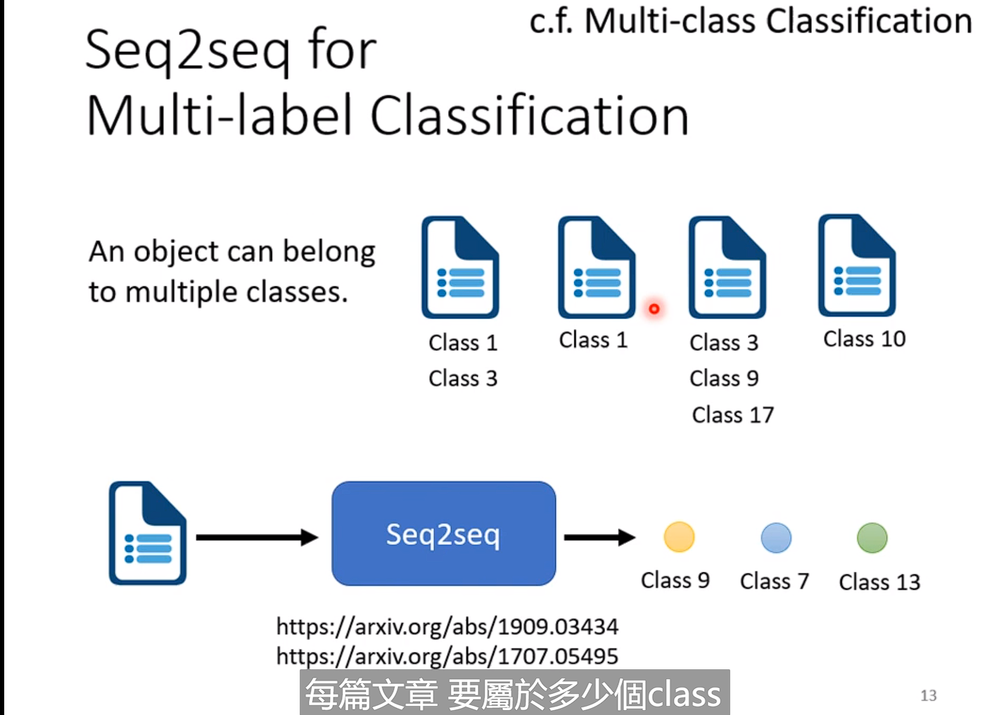

# Encoder
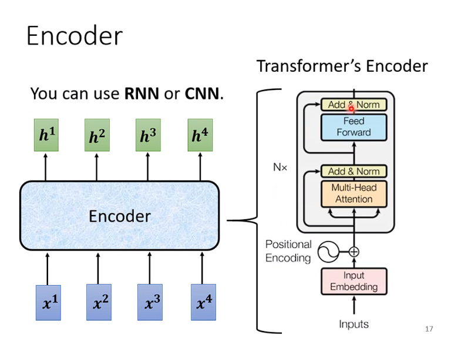

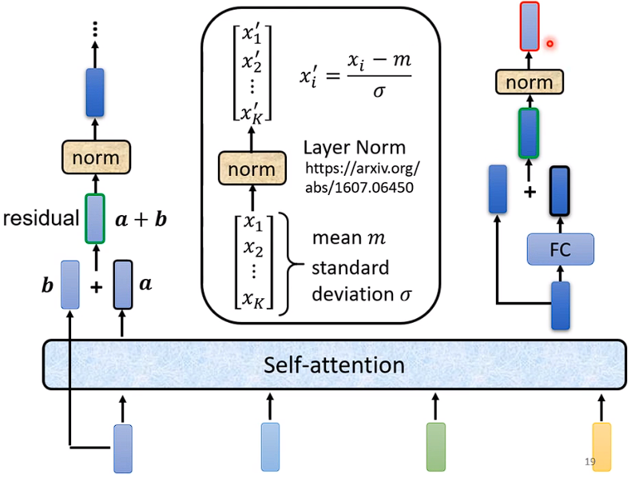

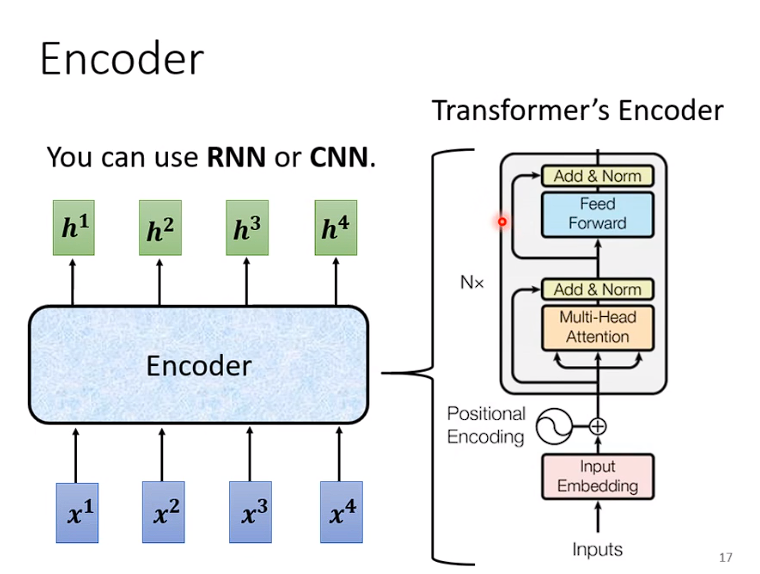
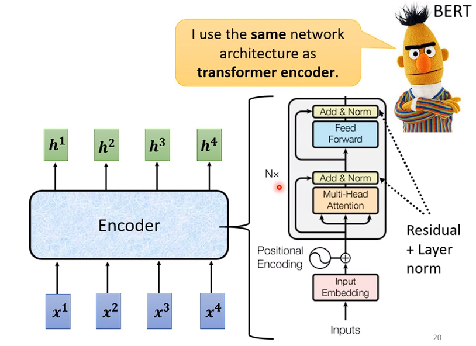
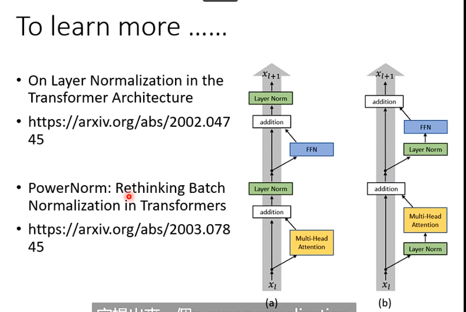
**Positional Encoding**

