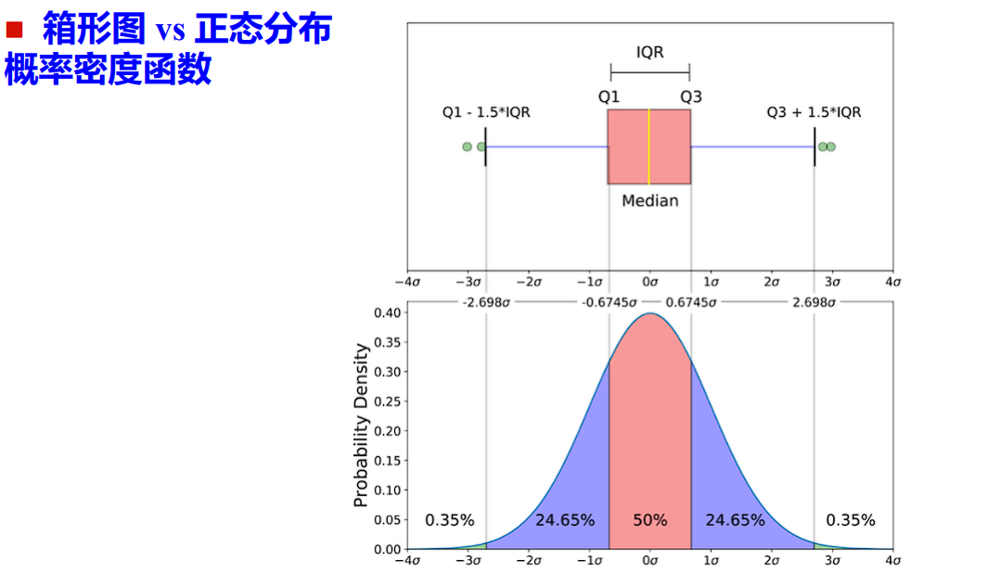
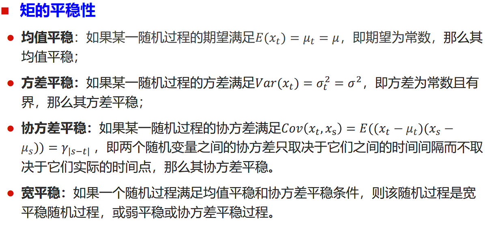
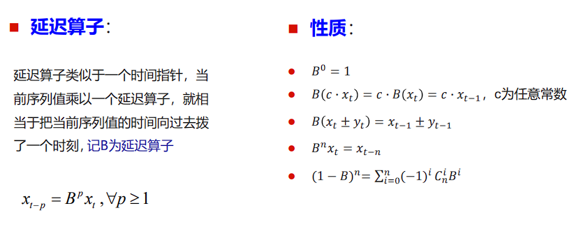
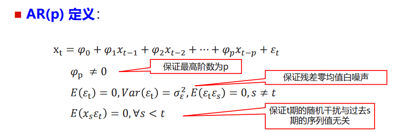
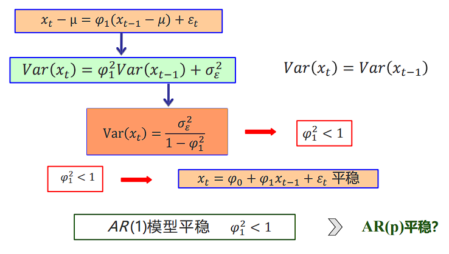
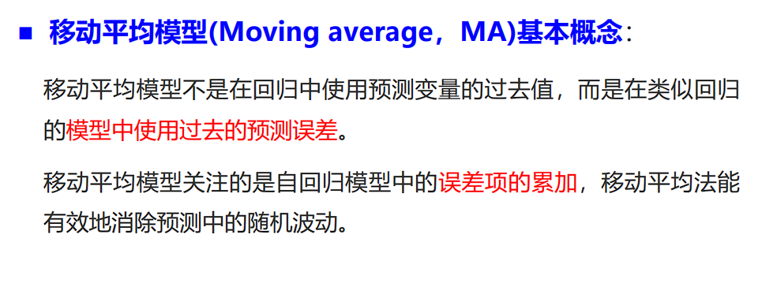
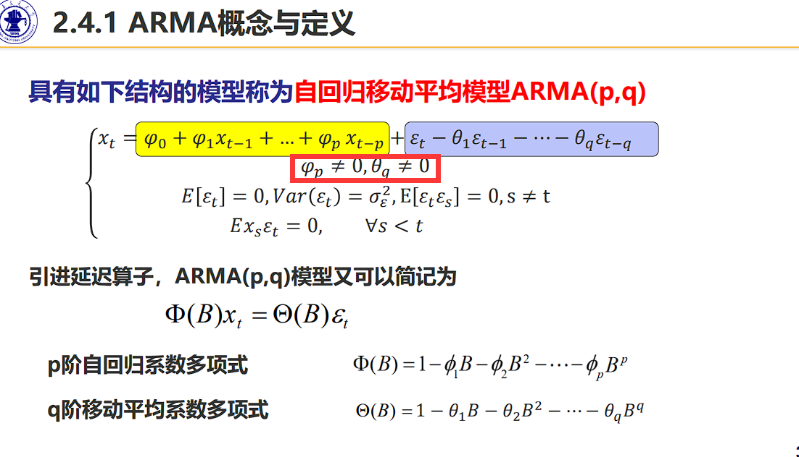

## 
## ACF


**Code**
```
import numpy as np

# 定义时间序列数据
x = np.array([100, 102, 101, 103, 102, 104, 103, 105, 104])

# 计算时间序列的均值
x_mean = np.mean(x)

# 计算滞后1的自相关系数 rho_1
numerator = np.sum((x[:-1] - x_mean) * (x[1:] - x_mean))
denominator = np.sum((x - x_mean) ** 2)
rho_1 = numerator / denominator

rho_1
```

```
1、自相关系数的值域在 -1 和 1 之间，1 表示完全正相关，-1 表示完全负相关.
2、如果一个时间序列是纯随机的（即白噪音），那么其所有的滞后 k的自相关系数理论上应接近于 0
```


## 异常检测

箱线图 正常值要比正态分布要范围要小一些。


## 相关系数


只研究线性相关，不一定代表没有相关性！

## 平稳时间序列 非平稳的时间序列


```
如果一个随机过程是平稳的，那么他的时间序列也是平稳的

```



**协方差平稳 代表着方差平稳**


```
自相关函数和偏自相关函数
1、自相关函数得到的是y1和y3之间复杂的相关性，之中可能包含y2与y3之间的相关性
2、偏自相关 通过公式，求解之后，只考虑y1和y3的关系。
𝑦𝑡 = 𝛼0 + 𝛼1𝑦𝑡−1 + 𝛼2𝑦𝑡−2 + 𝛼3𝑦𝑡−3
α1，α2，α3，分别是1阶滞后，
2阶滞后，3阶滞后下的PACF
```

X1          X2            X3           X4
  X2-X1           X3-X2        X4-X3
   (X3-X2)-(X2-X1)   (X4-X3)-(X3-X2)  



延迟算子





## MA主要看的是历史白噪声


